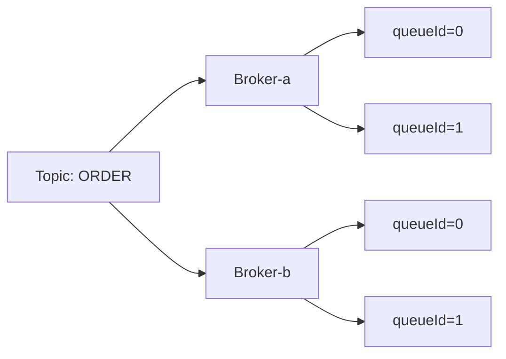

# MessageQueue 概念详解

`MessageQueue` 是客户端用于定位消息队列的**逻辑标识**，由 Topic、Broker 名称和队列编号组成；在普通 Topic 的使用方式上，它大致对应 Kafka 的 Partition。它本身不是物理存储单元，静态 Topic 等场景还会把逻辑队列映射到物理队列。

## 核心定义

源码位置：`common/src/main/java/org/apache/rocketmq/common/message/MessageQueue.java`

它本质上只是一个数据结构，包含三个字段：

```java
public class MessageQueue implements Serializable {
    private String topic;      // 所属主题
    private String brokerName; // 所在 Broker 名称
    private int queueId;       // 队列编号
}
```

`MessageQueue` 类不校验 `queueId` 的范围。普通 Topic 的生产路由使用 `writeQueueNums`，消费路由使用 `readQueueNums`；两者是独立配置。

## 关键理解点

1. **Topic 与 Broker 之间的桥梁**：一个 Topic 分布在多个 Broker 上，每个 Broker 上有若干个队列。`MessageQueue` 唯一确定了"某个 Topic 在某个 Broker 上的第 N 个队列"。

2. **并行度的基本单位**：
   - **发送端**: Producer 从发布路由中的 `MessageQueue` 选择一个写入。
   - **消费端**: 集群消费时，Rebalance 将一个 `MessageQueue` 分配给同组的一个消费者**实例**。并发监听器仍可让该队列的多个批次在本地线程池并行执行；只有顺序监听器会在本地串行消费该队列。

3. **与存储的对应关系**：
   - 对普通 Topic 而言，某个 Broker 上的 `topic + queueId` 对应一个消费索引队列（实现可为 `ConsumeQueue` 或 `BatchConsumeQueue`）。
   - 消息先顺序写入**该 Broker** 的 CommitLog 文件序列，再由 Reput 服务异步构建消费索引和 Key 索引。

4. **路由表中的体现**:`TopicPublishInfo` 中持有 `List<MessageQueue>`,Producer 发送时从中选一个：



上图中每个叶子节点就是一个 `MessageQueue`,共 4 个。

## 典型使用场景

| 场景 | 说明 |
|------|------|
| 负载均衡发送 | 默认关闭延迟故障规避时，按递增索引从发布队列中选择，并在重试时尽量避开上次 Broker |
| 顺序消息 | 应由业务选择器把相同 Sharding Key 映射到同一个 MessageQueue |
| 故障规避 | 启用发送延迟故障规避后，`MQFaultStrategy` 过滤暂不可用的 Broker |
| 消费重平衡 | `RebalanceImpl` 将 MessageQueue 分配给组内消费者实例 |

## 相关笔记

- [Producer MessageQueue 选择逻辑](producer-message-queue-selection.md) —— Producer 如何在这些 MessageQueue 中做选择
- [RocketMQ 消息存储模型详解](rocketmq_storage_model.md) —— MessageQueue 与 CommitLog/ConsumeQueue 的存储对应关系
