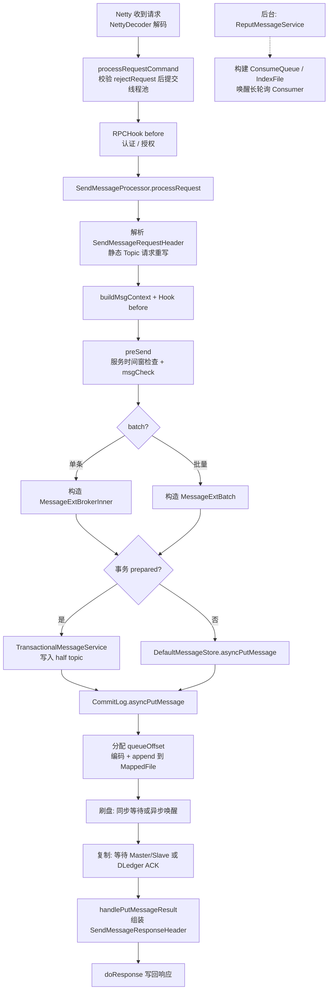

# Broker 收到 Producer 消息后的处理全流程

本文回答：**Broker 收到 Producer 的 `SEND_MESSAGE` 请求后，到底做了哪些事？**

主线源码：

- [`SendMessageProcessor.java`](../broker/src/main/java/org/apache/rocketmq/broker/processor/SendMessageProcessor.java)
- [`AbstractSendMessageProcessor.java`](../broker/src/main/java/org/apache/rocketmq/broker/processor/AbstractSendMessageProcessor.java)
- [`DefaultMessageStore.java`](../store/src/main/java/org/apache/rocketmq/store/DefaultMessageStore.java)
- [`CommitLog.java`](../store/src/main/java/org/apache/rocketmq/store/CommitLog.java)

## 全流程总览



## 1. 网络层与线程模型

源码位置：

- 解码与分发：`org.apache.rocketmq.remoting.netty.NettyRemotingAbstract#processRequestCommand`
  （[`NettyRemotingAbstract.java`](../remoting/src/main/java/org/apache/rocketmq/remoting/netty/NettyRemotingAbstract.java)）
- 快速失败判断：`org.apache.rocketmq.broker.processor.SendMessageProcessor#rejectRequest`
- 线程池创建：`org.apache.rocketmq.broker.BrokerController#initializeResources`
- 处理器注册：`org.apache.rocketmq.broker.BrokerController#registerProcessor`

1. **解码**：`NettyDecoder` 把字节流还原为 `RemotingCommand`。
2. **分发**：`NettyRemotingAbstract.processRequestCommand` 根据 RequestCode 找到注册的
   `SendMessageProcessor`，先调用 `rejectRequest()` 快速失败：
   - 非 slave acting master 场景下，当前节点角色是 SLAVE，直接拒绝；
   - `isOSPageCacheBusy()`（页缓存忙）或 transient store pool 不足时拒绝，返回
     `SYSTEM_BUSY`，客户端会重试其他 Broker。
3. **线程池**：通过校验后任务被提交到 `SendMessageThread_` 线程池执行，不占用 Netty IO 线程。
4. **RPC Hook**：执行注册的 `RPCHook.doBeforeRequest`，完成认证与授权（如 ACL）。

### 1.1 `rejectRequest()` 快速失败的含义与动机

"快速失败"（fail-fast）指请求还没进入真正的发送处理逻辑（解析消息、写存储）之前，
就提前判断出"这个 Broker 现在肯定处理不了"，直接返回失败响应，避免白做后续工作。

源码位置：[`SendMessageProcessor.java`](../broker/src/main/java/org/apache/rocketmq/broker/processor/SendMessageProcessor.java) 的 `rejectRequest()`：

```java
public boolean rejectRequest() {
    // 条件1：当前节点是 SLAVE（且未开启 slave acting master）
    if (!enableSlaveActingMaster && brokerRole == BrokerRole.SLAVE) {
        return true;
    }
    // 条件2：OS 页缓存忙（写入压力过大）
    if (getMessageStore().isOSPageCacheBusy()
        || getMessageStore().isTransientStorePoolDeficient()) {
        return true;
    }
    return false;
}
```

为什么要拒绝：

- **条件 1**：消息必须写到 Master 的 CommitLog，Slave 只负责读和备份。不拦截的话，
  消息到了 Slave 才发现写不了，已经浪费了解码、线程池调度、Hook 等开销。
- **条件 2**：消息写入依赖 OS page cache（先写内存页再异步刷盘）。写入速度远超刷盘
  速度时 page cache 变脏变满，继续接收只会导致写入延迟暴涨甚至 OOM。
  `isOSPageCacheBusy()` 通过最近一次写入 lock 时间是否超过阈值判断
  （默认 `osPageCacheBusyTimeOutMills=1000ms`）；transient store pool 耗尽说明
  开启读写分离时刷盘跟不上写入。主动拒绝一部分流量是背压（backpressure）思想，
  保护 Broker 自身和已接受的请求。

快速的价值：

| 不做快速失败 | 快速失败 |
| --- | --- |
| 进线程池排队 → 解析 → Hook → msgCheck → 写存储卡顿 → 超时 | 解码后一个 if 判断 → 立即回 `SYSTEM_BUSY` |
| 客户端等满整个超时周期（默认 3s）才重试 | 客户端毫秒级拿到失败，马上换 Broker 重试 |

客户端侧配合：`SYSTEM_BUSY` 在同步发送的 `retryResponseCodes` 列表里，Producer 收到后
会自动选其他 Broker 重试，业务几乎无感。

### 1.2 线程池提交逻辑的具体代码位置

线程池逻辑分布在三个文件：

**(1) 线程池创建**：`BrokerController.initializeResources()`
（`broker/src/main/java/org/apache/rocketmq/broker/BrokerController.java`）

```java
this.sendMessageExecutor = ThreadUtils.newThreadPoolExecutor(
    this.brokerConfig.getSendMessageThreadPoolNums(),   // 默认 1
    this.brokerConfig.getSendMessageThreadPoolNums(),
    1000 * 60, TimeUnit.MILLISECONDS,
    this.sendThreadPoolQueue,                            // 有界队列，默认容量 10000
    new ThreadFactoryImpl("SendMessageThread_", ...));   // 线程名前缀
```

**(2) 处理器与线程池绑定**：`BrokerController.registerProcessor()`，
把 RequestCode -> (Processor, 线程池) 注册到 `processorTable`：

```java
remotingServer.registerProcessor(RequestCode.SEND_MESSAGE, sendMessageProcessor, this.sendMessageExecutor);
remotingServer.registerProcessor(RequestCode.SEND_MESSAGE_V2, sendMessageProcessor, this.sendMessageExecutor);
remotingServer.registerProcessor(RequestCode.SEND_BATCH_MESSAGE, sendMessageProcessor, this.sendMessageExecutor);
```

**(3) 真正的提交**：`NettyRemotingAbstract.processRequestCommand()`
（`remoting/src/main/java/org/apache/rocketmq/remoting/netty/NettyRemotingAbstract.java`），
这是 Netty IO 线程回调的地方：

```java
// 从 processorTable 按 requestCode 找到 (processor, executorService) 对
final Pair<NettyRequestProcessor, ExecutorService> pair = this.processorTable.get(cmd.getCode());

// rejectRequest 快速失败就在这里
if (pair.getObject1().rejectRequest()) {
    // 直接回 SYSTEM_BUSY，不提交线程池
}

// 包装成 RequestTask，提交到注册时绑定的线程池
final RequestTask requestTask = new RequestTask(run, ctx.channel(), cmd);
// async execute task, current thread return directly
pair.getObject2().submit(requestTask);   // 提交后 Netty IO 线程立即返回
```

流转示意：

```mermaid
flowchart LR
    A[Netty IO 线程<br/>收到字节流] --> B[NettyRemotingAbstract<br/>processRequestCommand]
    B --> C{rejectRequest?}
    C -- 是 --> D[直接回 SYSTEM_BUSY]
    C -- 否 --> E[executor.submit&#40;RequestTask&#41;]
    E --> F[IO 线程立即返回]
    E --> G[SendMessageThread_ 线程<br/>执行 processRequest]
```



补充两点：

- **隔离设计**：不同业务用不同线程池——发送用 `sendMessageExecutor`、拉取用
  `pullMessageExecutor`、心跳用 `heartbeatExecutor` 等，互不拖累；发送卡顿不影响消费请求。
- **线程池打满兜底**：`submit` 抛 `RejectedExecutionException` 时（有界队列满），
  同样回 `SYSTEM_BUSY`，客户端会重试其他 Broker。
- 异步路径下响应续接用的是另一个线程池
  （`asyncPutMessageFuture.thenAcceptAsync(..., putMessageFutureExecutor)`），
  所以 Broker 发送线程在提交存储后也能提前释放。

## 2. `processRequest` 入口处理

源码位置：`org.apache.rocketmq.broker.processor.SendMessageProcessor#processRequest(ChannelHandlerContext, RemotingCommand)`
（[`SendMessageProcessor.java`](../broker/src/main/java/org/apache/rocketmq/broker/processor/SendMessageProcessor.java)），
由 `NettyRemotingAbstract.processRequestCommand` 在 `SendMessageThread_` 线程里调用。

```text
CONSUMER_SEND_MSG_BACK
  -> SendMessageProcessor#consumerSendMsgBack   走消费重试分支（不是生产发送）
默认（SEND_MESSAGE / SEND_MESSAGE_V2 / SEND_BATCH_MESSAGE）:
  SendMessageProcessor#parseRequestHeader                          解析 V1/V2 请求头
  TopicQueueMappingManager#buildTopicQueueMappingContext           静态 Topic 映射上下文
  TopicQueueMappingManager#rewriteRequestForStaticTopic            必要时改写 queueId（静态 Topic）
  AbstractSendMessageProcessor#buildMsgContext                     构造 SendMessageContext
  AbstractSendMessageProcessor#executeSendMessageHookBefore        Broker 端 SendMessageHook（Trace 等），可 AbortProcessException 中止
  SendMessageProcessor#clearReservedProperties                     删除保留属性（如 POP_CK）
  按 requestHeader.isBatch() 分发到
    SendMessageProcessor#sendMessage（单条）
    SendMessageProcessor#sendBatchMessage（批量）
```

各步骤对应方法（均在 `SendMessageProcessor` 或其父类中）：

| 步骤 | 方法 | 所在类 |
| --- | --- | --- |
| 解析请求头 | `parseRequestHeader` | `SendMessageProcessor` |
| 静态 Topic 映射上下文 | `TopicQueueMappingManager.buildTopicQueueMappingContext` | `common`/`broker` 模块 |
| 静态 Topic 重写 | `TopicQueueMappingManager.rewriteRequestForStaticTopic` | 同上 |
| 构造上下文 | `AbstractSendMessageProcessor.buildMsgContext` | `AbstractSendMessageProcessor` |
| Hook before/after | `executeSendMessageHookBefore` / `executeSendMessageHookAfter` | `AbstractSendMessageProcessor` |
| 清理保留属性 | `SendMessageProcessor.clearReservedProperties` | `SendMessageProcessor` |
| 单条分发 | `SendMessageProcessor.sendMessage` | `SendMessageProcessor` |
| 批量分发 | `SendMessageProcessor.sendBatchMessage` | `SendMessageProcessor` |

注意：该 Processor 还处理 `CONSUMER_SEND_MSG_BACK`（code=15），消费重试消息复用同一入口但走完全不同的分支。

## 3. `preSend` 前置检查

源码位置：

- 时间窗检查：`org.apache.rocketmq.broker.processor.SendMessageProcessor#preSend`
- Topic/queueId 校验：`org.apache.rocketmq.broker.processor.AbstractSendMessageProcessor#msgCheck`

- **服务时间窗**：当前时间早于 `startAcceptSendRequestTimeStamp` 时拒绝（用于有序重启）。
- **msgCheck**（在 `AbstractSendMessageProcessor` 中）：
  1. Broker 写权限检查（顺序 Topic 场景要求 Broker 可写）；
  2. Topic 合法性校验、禁止发送的系统 Topic 检查；
  3. **Topic 不存在时的自动创建**：用 `TBW102` 默认队列数调
     `createTopicInSendMessageMethod`；创建失败则返回 `TOPIC_NOT_EXIST`；
  4. queueId 越界检查（超过写/读队列最大值返回 `INVALID_PARAMETER`）。

## 4. 构造存储消息对象

源码位置：`org.apache.rocketmq.broker.processor.SendMessageProcessor#sendMessage`
（单条）与 `#sendBatchMessage`（批量），Retry/DLQ 判断在
`org.apache.rocketmq.broker.processor.SendMessageProcessor#handleRetryAndDLQ`。

单条路径把请求还原成 `MessageExtBrokerInner`：

| 字段 | 来源 |
| --- | --- |
| topic / queueId | 请求头；queueId < 0 时由 Broker 在写队列中随机选择 |
| body / flag | 请求体（压缩形态直接进入 CommitLog） |
| UNIQ_KEY | 客户端已带则沿用；缺失时 Broker 补生成 |
| bornTimestamp / bornHost | 请求头 / Channel 远端地址 |
| storeHost | Broker 本机地址 |
| reconsumeTimes | 请求头（Retry Topic 消息） |
| CLUSTER 属性 | Broker 配置补写 |
| tagsCode | 按 Topic 过滤类型从 Tag 计算 |

期间还有几类特殊处理：

- **Retry / DLQ**（`handleRetryAndDLQ`）：Topic 以 `%RETRY%` 开头时，检查消费组存在性；
  超过 `maxReconsumeTimes`（或顺序消息锁未过期）则改写到死信 Topic `%DLQ%group%`，
  并取消延时级别。
- **LMQ / Lite Topic**：带 `LITE_TOPIC` 属性时改写为 `INNER_MULTI_DISPATCH` 多分发属性。
- **Priority**：优先级消息按 priority 重选 queueId，非法时清除该属性。
- **COMPACTION Topic**：要求消息必须有 key，否则 `MESSAGE_ILLEGAL`。
- **事务半消息**：属性含 `TRANSACTION_PREPARED` 且 Broker 允许事务时，
  改走 `TransactionalMessageService.asyncPrepareMessage`，写入系统 half topic，
  而不是普通 CommitLog 主线。

批量路径类似，构造 `MessageExtBatch`；若 Topic 是 BatchConsumeQueue 且批次带 UNIQ_KEY，
标记为 inner-batch（`NEED_UNWRAP_FLAG`），统计 `INNER_NUM` 并在响应里回传 `batchUniqId`。

## 5. 写入存储：`DefaultMessageStore.asyncPutMessage`

源码位置：

- 入口：`org.apache.rocketmq.store.DefaultMessageStore#asyncPutMessage`
  （[`DefaultMessageStore.java`](../store/src/main/java/org/apache/rocketmq/store/DefaultMessageStore.java)）
- 主线：`org.apache.rocketmq.store.CommitLog#asyncPutMessage`
  （[`CommitLog.java`](../store/src/main/java/org/apache/rocketmq/store/CommitLog.java)）

默认 `asyncSendEnable=true`，发送线程把 future 续接交给 `putMessageFutureExecutor`，
自己立即释放。`CommitLog.asyncPutMessage` 内部：

1. **PutMessageHook**：执行 `executeBeforePutMessage`（如统计）。
2. **分配 queueOffset**：从该 Queue 的逻辑偏移器取下一个 offset。
3. **编码**：消息统一编码为 CommitLog 定长头 + 变长体的二进制记录。
4. **append**：定位当前 `MappedFileQueue` 的最后一个 MappedFile，追加写入；
   文件满或不存在则新建（默认 1GB）。空间不足、文件耗尽等在此返回失败状态。
5. **刷盘**：
   - `SYNC_FLUSH`：阻塞等待 GroupCommitService 完成后才继续；
   - `ASYNC_FLUSH`（默认）：唤醒 FlushRealTimeService 即返回，落页缓存即算成功。
6. **复制**：
   - 主从同步复制：等待 Slave 拉取确认；
   - 异步复制（默认）：不等 Slave；
   - DLedger/Controller 模式：按多数派 ACK。

注意：`asyncPutMessage` 名字里的 async 只针对刷盘/复制的 future 与响应续接；
编码和内存 append 仍在 Broker 发送线程同步完成。

## 6. 组装并写回响应

源码位置：`org.apache.rocketmq.broker.processor.SendMessageProcessor#handlePutMessageResult`，
写回通过 `AbstractSendMessageProcessor#doResponse`（内部调用
`NettyRemotingAbstract.writeResponse`）。

`handlePutMessageResult` 把 `PutMessageResult` 翻译成响应：
- 成功：`ResponseCode.SUCCESS` + `SendMessageResponseHeader`
  （`msgId`=offsetMsgId 物理消息 id、`queueId`、`queueOffset`、事务相关的
  `transactionId`，以及静态 Topic 的逻辑 offset 回转）。
- 失败：按状态映射错误码——磁盘满 `OS_PAGE_CACHE_BUSY`/`SYSTEM_ERROR`、
  消息过大 `MESSAGE_ILLEGAL`、未知异常 `SYSTEM_ERROR` 等。

最后 `doResponse` 通过原 Channel 写回，opaque 匹配客户端挂起的 ResponseFuture。
异步路径下这一步发生在 future 回调线程，Broker 发送线程早已释放。

## 7. 响应之后：Broker 后台异步工作

源码位置：

- 索引构建：`org.apache.rocketmq.store.DefaultMessageStore.ReputMessageService#run`
  （内部类，`DefaultMessageStore.java`），分发逻辑在
  `org.apache.rocketmq.store.DefaultMessageStore#doReput`
- 长轮询唤醒：`org.apache.rocketmq.broker.longpolling.NotifyMessageArrivingListener#messageArriving`
  （由 `DefaultMessageStore` 注册），挂起请求管理在
  `org.apache.rocketmq.broker.longpolling.PullRequestHoldService`

这些不阻塞发送响应，但决定消息何时可被消费：

1. **ReputMessageService** 持续扫描 CommitLog 新增记录，向各 Queue 分发：
   构建/更新 `ConsumeQueue`（逻辑索引）和 `IndexFile`（按 key/time 查询）。
2. **长轮询唤醒**：有匹配的挂起 Pull/Pop 请求时立即通知 Consumer，降低消费延迟。
3. **统计与指标**：TPS、耗时直方图、事务指标（半消息计数）等。

## 关键结论

- Broker 对一次发送的核心动作是：**校验 → 还原消息元数据 → 追加 CommitLog →
  （按配置）等刷盘和复制 → 回响应**。
- 响应成功只保证"已写入 CommitLog 并满足刷盘/复制策略"，不保证 ConsumeQueue 已构建、
  更不保证已被消费。
- 大量失败场景（SLAVE 角色、页缓存忙、Topic 不存在且不能自动创建、queueId 越界、
  死信改写失败）都在真正写存储之前就被拦截，客户端据此决定是否换 Broker 重试。

相关笔记：

- [Producer 发送消息源码全链路](rocketmq_producer_send_source_flow.md)
- [Producer 与 Broker/NameServer 的通信全景](rocketmq_producer_broker_communication.md)
- [RocketMQ 消息存储模型详解](rocketmq_storage_model.md)
