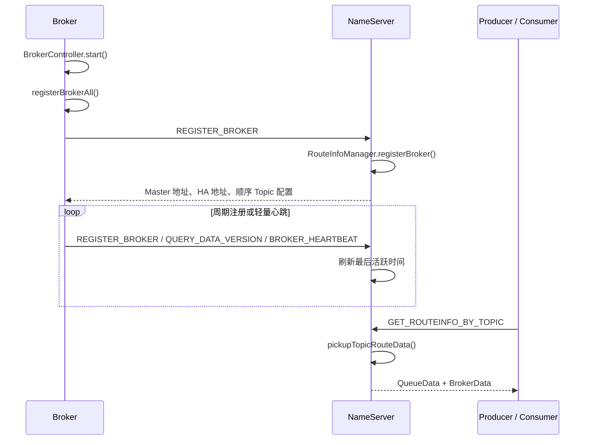

# RocketMQ Broker 路由注册机制

Broker 路由注册的本质是：Broker 主动把自己所属的集群、主从实例地址、Topic 及队列配置
上报给所有 NameServer。NameServer 将这些信息保存在内存路由表中，供 Producer 和 Consumer
查询。

本文基于当前仓库 `learning` 分支源码整理。

## 零、Topic 与 Broker 的关系和创建位置

### 1. Topic、Broker 和 MessageQueue

Topic 是消息的逻辑分类，Broker 是存储和传输消息的服务节点。二者是多对多关系：一个
Topic 可以分布在多个 Broker 上，一个 Broker 也可以承载多个 Topic。

Topic 在每个 Broker 上会被划分为若干 `MessageQueue`。一个队列由下面三个字段唯一确定：

```text
(topic, brokerName, queueId)
```

例如，`OrderTopic` 分布在两个 Broker 复制组上，每组配置两个队列：

```text
OrderTopic
├── broker-a
│   ├── Queue 0
│   └── Queue 1
└── broker-b
    ├── Queue 0
    └── Queue 1
```

Broker 把这些 Topic 和队列配置注册到 NameServer。Producer 查询路由后选择其中一个
`MessageQueue`，再向对应 Broker 发送消息；Consumer 查询相同路由后消费 Topic 的所有
队列，集群消费模式下再把这些队列分配给不同 Consumer。

Broker 内部并不是为每个 Topic 单独保存一份消息文件。所有 Topic 的消息主体统一顺序写入
`CommitLog`，再通过按 `Topic + queueId` 组织的 `ConsumeQueue` 建立消费索引。详细存储
结构见 [RocketMQ 消息存储模型详解](rocketmq_storage_model.md)。

因此可以把三者的关系概括为：**Topic 决定消息属于哪一类，Broker 决定消息存在哪里，
MessageQueue 是 Topic 在 Broker 上的实际分片。**

### 2. Broker 如何知道自己承载哪些 Topic

Broker 不会扫描消息文件推断 Topic，也不是由 NameServer 向它下发 Topic 配置。Broker
自己维护 `TopicConfigManager.topicConfigTable`，其中每个 `TopicConfig` 保存 Topic 名称、
读写队列数、权限和系统标记等信息：

```text
管理命令 / 自动创建 / 启动加载 / 主从同步
                    ↓
Broker.topicConfigTable
  TopicA -> readQueueNums=4, writeQueueNums=4
                    ↓
持久化 topics.json
                    ↓
增量或周期注册到 NameServer
```

这张配置表主要有以下来源：

1. **管理命令创建或修改**：`mqadmin updateTopic` 将完整的 `TopicConfig` 直接发送给目标
   Broker。Broker 更新内存表、持久化配置，并立即向 NameServer 增量注册。
2. **Broker 启动加载**：Broker 从
   `${storePathRootDir}/config/topics.json` 恢复已有 Topic 配置。
3. **自动创建**：开启 `autoCreateTopicEnable=true` 后，Broker 收到发往不存在 Topic 的
   消息时，可以根据默认 Topic `TBW102` 创建配置。队列数取 Producer 默认值和
   `TBW102` 队列数中的较小值。
4. **系统 Topic 初始化**：Broker 启动时直接初始化自测、延迟消息和集群等系统 Topic。
5. **Slave 同步**：经典 Master-Slave 模式下，Slave 会从 Master 获取 Topic 配置，并在
   `DataVersion` 变化时替换自己的本地配置表。

相关实现位于
[TopicConfigManager.java](../broker/src/main/java/org/apache/rocketmq/broker/topic/TopicConfigManager.java)、
[AdminBrokerProcessor.java](../broker/src/main/java/org/apache/rocketmq/broker/processor/AdminBrokerProcessor.java)
和 [SlaveSynchronize.java](../broker/src/main/java/org/apache/rocketmq/broker/slave/SlaveSynchronize.java)。

Broker 注册时遍历自己的 `topicConfigTable`，将 Topic 名称、读写队列数和权限打包上报。
所以顺序是：**Broker 先有本地 Topic 配置，NameServer 再根据 Broker 的上报生成路由。**

### 3. 使用 Topic 前是否必须创建

严格来说不一定：开启 `autoCreateTopicEnable=true` 时，第一次发送消息可以触发 Broker
自动创建 Topic。关闭自动创建时，Topic 不存在会导致发送失败，Producer 最终得到
`No route info of this topic` 或 Broker 返回 `TOPIC_NOT_EXIST`。

生产环境通常应提前显式创建 Topic，确保队列数量、权限和 Broker 分布是确定的，而不是
由第一次发送消息的选路结果决定。

### 4. Topic 最终位于哪些 Broker

Topic 不会“运行”在某个 Broker 中；它的配置和消息由创建时选定的 Broker 承载。执行
管理命令的机器与 Topic 位于哪里无关，`-b` 或 `-c` 参数才决定目标。

按集群创建：

```bash
sh mqadmin updateTopic \
  -n nameserver:9876 \
  -c DefaultCluster \
  -t OrderTopic \
  -r 4 \
  -w 4
```

`-c DefaultCluster` 会从 NameServer 找到该集群的所有 Master 地址，并分别创建 Topic。
假设集群有 `broker-a`、`broker-b` 两个复制组，那么结果是：

```text
OrderTopic
├── broker-a：Queue 0～3
└── broker-b：Queue 0～3
```

该 Topic 一共有 8 个可写逻辑队列，Producer 根据 NameServer 返回的路由把消息发送到
`broker-a` 或 `broker-b`。

按单个 Broker 创建：

```bash
sh mqadmin updateTopic \
  -n nameserver:9876 \
  -b 192.168.1.10:10911 \
  -t OrderTopic \
  -r 4 \
  -w 4
```

此时 Topic 只由指定 Broker 复制组承载，Producer 的路由中也只有该组的队列。管理命令的
具体选点逻辑见
[UpdateTopicSubCommand.java](../tools/src/main/java/org/apache/rocketmq/tools/command/topic/UpdateTopicSubCommand.java)。

Master-Slave 模式下，管理命令向 Master 创建 Topic，Topic 配置和消息随后同步到 Slave。
Master 和 Slave 属于同一个 `brokerName` 复制组，Slave 是副本，不会让 Topic 的逻辑队列
数量翻倍。Producer 应用运行在哪台机器，与 Topic 最终由哪些 Broker 承载也没有关系。

## 一、整体调用链



核心调用链如下：

```text
BrokerController.start()
  -> registerBrokerAll()
    -> doRegisterBrokerAll()
      -> BrokerOuterAPI.registerBrokerAll()
        -> 向每个 NameServer 发送 REGISTER_BROKER

DefaultRequestProcessor.registerBroker()
  -> RouteInfoManager.registerBroker()
    -> 更新集群、Broker、Topic 和存活路由表
```

Broker 入口在
[BrokerController.java](../broker/src/main/java/org/apache/rocketmq/broker/BrokerController.java)，
NameServer 注册入口在
[DefaultRequestProcessor.java](../namesrv/src/main/java/org/apache/rocketmq/namesrv/processor/DefaultRequestProcessor.java)。

## 二、Broker 什么时候注册

### 1. 启动时立即注册

Broker 启动基础服务后，在非隔离、非 DLedger CommitLog、非 Duplication 模式下立即执行：

```java
this.registerBrokerAll(true, false, true);
```

这里最后一个参数 `true` 表示强制注册，不先比较路由版本。

### 2. 周期注册

Broker 随后创建周期任务，再次调用 `registerBrokerAll()`。默认配置为：

| 配置 | 默认值 | 作用 |
| --- | --- | --- |
| `registerNameServerPeriod` | 30 秒 | 向 NameServer 注册的周期 |
| `forceRegister` | `true` | 每个周期是否直接发送完整注册数据 |
| `registerBrokerTimeoutMills` | 24 秒 | 一轮注册的等待上限 |

实际注册周期会被限制在 10 秒到 60 秒之间。配置定义在
[BrokerConfig.java](../common/src/main/java/org/apache/rocketmq/common/BrokerConfig.java)。

默认情况下，Broker 每 30 秒向所有可用 NameServer 重新发送完整路由。完整注册同时刷新
NameServer 中的 Broker 活跃时间，因此也承担保活作用。

如果设置 `forceRegister=false`，Broker 会先向每个 NameServer 发送
`QUERY_DATA_VERSION`：

```text
Broker DataVersion == NameServer DataVersion
  -> 不发送完整路由，只刷新活跃时间

任一 NameServer 版本不同、路由缺失或查询异常
  -> 向所有 NameServer 重新注册完整路由
```

版本探测在
[BrokerOuterAPI.java](../broker/src/main/java/org/apache/rocketmq/broker/out/BrokerOuterAPI.java) 的
`needRegister()` 中实现。

### 3. Topic 变化时立即注册

Topic 创建或修改时，Broker 不必等待下一次周期任务。默认会调用
`registerIncrementBrokerData()`，立即上报变化的 Topic；开启
`enableSingleTopicRegister` 后，则通过独立的 `REGISTER_TOPIC_IN_NAMESRV` 请求注册单个
Topic。

入口在
[TopicConfigManager.java](../broker/src/main/java/org/apache/rocketmq/broker/topic/TopicConfigManager.java)
和 `BrokerController.registerIncrementBrokerData()`。

## 三、注册请求包含什么

### 1. 请求头

`RegisterBrokerRequestHeader` 主要包含：

| 字段 | 含义 |
| --- | --- |
| `clusterName` | Broker 所属集群 |
| `brokerName` | 主从复制组名称 |
| `brokerId` | 组内实例 ID，通常 `0` 是 Master，非 `0` 是 Slave |
| `brokerAddr` | 客户端访问 Broker 的地址 |
| `haServerAddr` | 主从复制使用的 HA 地址 |
| `heartbeatTimeoutMillis` | NameServer 判断 Broker 失活的超时时间 |
| `enableActingMaster` | 是否允许 Slave Acting Master |
| `compressed` | Body 是否使用压缩格式 |
| `bodyCrc32` | 注册 Body 的 CRC32 校验值 |

定义见
[RegisterBrokerRequestHeader.java](../remoting/src/main/java/org/apache/rocketmq/remoting/protocol/header/namesrv/RegisterBrokerRequestHeader.java)。

RocketMQ 使用自己的 Remoting 协议，并不是 HTTP 请求。请求头字段会作为字符串写入
`RemotingCommand.extFields`。例如，一个 Master 的普通注册请求可以理解为：

```text
code = 103  // REGISTER_BROKER
extFields = {
  clusterName: "DefaultCluster",
  brokerName: "broker-a",
  brokerId: "0",
  brokerAddr: "10.0.0.1:10911",
  haServerAddr: "10.0.0.1:10912",
  enableActingMaster: "false",
  compressed: "false",
  bodyCrc32: "1657123456"
}
```

其中 `bodyCrc32` 会根据本次 Body 的实际字节变化。普通模式不发送可选的
`heartbeatTimeoutMillis`；例如开启 Slave Acting Master 后，请求头还会包含
`heartbeatTimeoutMillis: "10000"`，同时 `enableActingMaster` 为 `"true"`。

### 2. 请求体

```text
RegisterBrokerBody
├── TopicConfigAndMappingSerializeWrapper
│   ├── dataVersion
│   ├── topicConfigTable
│   ├── topicQueueMappingInfoMap
│   ├── topicQueueMappingDetailMap
│   └── mappingDataVersion
└── filterServerList
```

每个 `TopicConfig` 包含读写队列数、权限和 Topic 系统标记等。Broker 在上报前会将 Topic
权限与 Broker 全局权限做按位与，避免只读 Broker 注册出可写路由。

请求体定义见
[RegisterBrokerBody.java](../remoting/src/main/java/org/apache/rocketmq/remoting/protocol/body/RegisterBrokerBody.java)。

例如，`broker-a` 上报一个具有 4 个读写队列的普通 `TopicA` 时，未压缩 Body 展开后大致
如下。JSON 字段顺序不影响含义：

```json
{
  "topicConfigSerializeWrapper": {
    "dataVersion": {
      "stateVersion": 0,
      "timestamp": 1787184000000,
      "counter": 12
    },
    "topicConfigTable": {
      "TopicA": {
        "topicName": "TopicA",
        "readQueueNums": 4,
        "writeQueueNums": 4,
        "perm": 6,
        "topicFilterType": "SINGLE_TAG",
        "topicSysFlag": 0,
        "order": false,
        "attributes": {}
      }
    },
    "topicQueueMappingInfoMap": {},
    "topicQueueMappingDetailMap": {},
    "mappingDataVersion": {
      "stateVersion": 0,
      "timestamp": 1787184000000,
      "counter": 0
    }
  },
  "filterServerList": []
}
```

这里 `perm=6` 表示同时可读、可写；`DataVersion` 用于判断 Topic 配置是否变化。普通 Topic
没有静态 Topic 映射，因此示例中的映射表为空；当前常规注册也不使用 FilterServer，所以
`filterServerList` 通常为空数组。

注意：上面的 JSON 只表示请求体，不是完整的 `REGISTER_BROKER` 请求。Broker 自身信息在
同一个 `RemotingCommand` 的请求头 `extFields` 中：

```text
完整 REGISTER_BROKER 请求
├── code = 103
├── header.extFields
│   ├── clusterName   = "DefaultCluster"
│   ├── brokerName    = "broker-a"
│   ├── brokerId      = "0"
│   ├── brokerAddr    = "10.0.0.1:10911"  // Broker 客户端地址
│   ├── haServerAddr  = "10.0.0.1:10912"  // HA 复制地址
│   ├── enableActingMaster
│   ├── heartbeatTimeoutMillis
│   ├── compressed
│   └── bodyCrc32
└── body = 上面的 topicConfigSerializeWrapper + filterServerList
```

因此，`brokerAddr` 和 `haServerAddr` 不会出现在 `topicConfigTable` 中：NameServer 使用
请求头的 `brokerAddr` 作为 `brokerLiveTable` 的实例键，并将 `brokerId -> brokerAddr` 写入
`brokerAddrTable`；请求体里的 Topic 配置则转换成 `topicQueueTable` 中的 `QueueData`。

Broker 会先序列化一次请求体并计算 CRC32，然后并发向所有可用 NameServer 发送同一份
`REGISTER_BROKER` 请求。各 NameServer 节点独立处理，彼此之间不复制路由数据。

## 四、brokerName 和 brokerId 的关系

`brokerName` 表示一个复制组，`brokerId` 表示复制组中的具体实例。例如：

```text
clusterName = DefaultCluster
brokerName  = broker-a
brokerId 0  = 10.0.0.1:10911  // Master
brokerId 1  = 10.0.0.2:10911  // Slave
TopicA      = 4 个读队列、4 个写队列
```

NameServer 保存为：

```text
clusterAddrTable:
  DefaultCluster -> {broker-a}

brokerAddrTable:
  broker-a -> {
    0: 10.0.0.1:10911,
    1: 10.0.0.2:10911
  }

topicQueueTable:
  TopicA -> {
    broker-a: QueueData(read=4, write=4, perm=RW)
  }
```

因此，Topic 路由按 `brokerName` 关联复制组，只保存一份 `QueueData`；Master 和 Slave 的
真实地址才通过 `brokerId` 区分。NameServer 不会为每个主从实例分别创建一套逻辑队列。

`MixAll.MASTER_ID` 的值是 `0`。Broker 地址模型见
[BrokerData.java](../remoting/src/main/java/org/apache/rocketmq/remoting/protocol/route/BrokerData.java)。

## 五、NameServer 如何更新路由表

NameServer 在收到注册请求后执行：

1. 校验请求体 CRC32。
2. 根据版本和压缩标志反序列化 Topic 配置。
3. 调用 `RouteInfoManager.registerBroker()` 更新内存路由。
4. 将 Master 地址、Master HA 地址和可选的顺序 Topic 配置返回给 Broker。

`RouteInfoManager` 维护六类主要数据：

| 路由表 | 数据关系 | 作用 |
| --- | --- | --- |
| `clusterAddrTable` | `clusterName -> Set<brokerName>` | 集群包含哪些复制组 |
| `brokerAddrTable` | `brokerName -> BrokerData` | 复制组及其 `brokerId -> brokerAddr` |
| `topicQueueTable` | `topic -> brokerName -> QueueData` | Topic 的队列数和权限 |
| `brokerLiveTable` | `(clusterName, brokerAddr) -> BrokerLiveInfo` | 活跃时间、超时、Channel、版本和 HA 地址 |
| `filterServerTable` | `(clusterName, brokerAddr) -> filterServerList` | FilterServer 地址 |
| `topicQueueMappingInfoTable` | `topic -> brokerName -> mappingInfo` | 静态 Topic 逻辑队列映射 |

沿用前文示例，假设 `broker-a` 的 Master 和 Slave 都已注册，Master 上报了普通
`TopicA`。此时六张表的内存数据大致如下，时间戳和 Netty Channel 仅作示意：

```text
clusterAddrTable = {
  "DefaultCluster": {"broker-a"}
}

brokerAddrTable = {
  "broker-a": BrokerData(
    cluster="DefaultCluster",
    brokerName="broker-a",
    brokerAddrs={
      0L: "10.0.0.1:10911",  // Master
      1L: "10.0.0.2:10911"   // Slave
    },
    zoneName=null,
    enableActingMaster=false
  )
}

topicQueueTable = {
  "TopicA": {
    "broker-a": QueueData(
      brokerName="broker-a",
      readQueueNums=4,
      writeQueueNums=4,
      perm=6,              // RW
      topicSysFlag=0
    )
  }
}

brokerLiveTable = {
  BrokerAddrInfo("DefaultCluster", "10.0.0.1:10911"):
    BrokerLiveInfo(
      lastUpdateTimestamp=1787184000123,
      heartbeatTimeoutMillis=120000,
      dataVersion=(stateVersion=0, timestamp=1787184000000, counter=12),
      channel=<Master 的 Netty Channel>,
      haServerAddr="10.0.0.1:10912"
    ),
  BrokerAddrInfo("DefaultCluster", "10.0.0.2:10911"):
    BrokerLiveInfo(
      lastUpdateTimestamp=1787184000456,
      heartbeatTimeoutMillis=120000,
      dataVersion=(stateVersion=0, timestamp=1787184000000, counter=12),
      channel=<Slave 的 Netty Channel>,
      haServerAddr="10.0.0.2:10912"
    )
}

filterServerTable = {}

topicQueueMappingInfoTable = {}
```

可以看到，`brokerAddrTable` 按复制组保存一份 `BrokerData`，其中包含两个物理实例；
`brokerLiveTable` 则按物理地址分别保存两份存活信息。`topicQueueTable` 按 `brokerName`
只有一份 `QueueData`，不会因为存在 Master 和 Slave 而变成两份。普通注册上报空
`filterServerList` 时，NameServer 会删除对应项，所以示例中 `filterServerTable` 是空表。

如果使用 FilterServer 或静态 Topic，对应的两张表可能是：

```text
filterServerTable = {
  BrokerAddrInfo("DefaultCluster", "10.0.0.1:10911"):
    ["10.0.0.1:12000"]
}

topicQueueMappingInfoTable = {
  "TopicA": {
    "broker-a": TopicQueueMappingInfo(
      topic="TopicA",
      scope="__global__",
      totalQueues=4,
      bname="broker-a",
      epoch=3,
      dirty=false,
      currIdMap={0: 0, 1: 1, 2: 2, 3: 3}
    )
  }
}
```

`currIdMap` 表示 `逻辑队列 ID -> 当前 Broker 上的物理队列 ID`。

这些字段和核心注册实现位于
[RouteInfoManager.java](../namesrv/src/main/java/org/apache/rocketmq/namesrv/routeinfo/RouteInfoManager.java)。

### 1. 更新集群与 Broker 实例

`registerBroker()` 在写锁内依次完成：

1. 将 `brokerName` 加入 `clusterAddrTable[clusterName]`。
2. 首次出现该 `brokerName` 时创建 `BrokerData`。
3. 更新 `enableActingMaster` 和 `zoneName`。
4. 将 `brokerId -> brokerAddr` 写入复制组地址表。

同一地址由 Slave 切换为 Master 时，代码先删除该地址对应的旧 `brokerId`，保证一个地址
不会同时对应两个 ID。

如果同一个 `brokerId` 换了地址，NameServer 会比较新旧 Broker 的 `stateVersion`。旧地址
对应的状态版本更高时，新注册会被拒绝，避免旧状态覆盖新状态。

### 2. 更新 Topic 队列

普通主从模式主要由 Master，也就是 `brokerId=0`，更新 Topic 路由。NameServer 将每个
`TopicConfig` 转换成一个 `QueueData`：

```text
TopicConfig
  -> brokerName
  -> readQueueNums
  -> writeQueueNums
  -> perm
  -> topicSysFlag
```

只有以下情况才需要新建或替换 `QueueData`：

- Broker 或该实例首次注册；
- Broker 上报的 `DataVersion` 与 NameServer 保存的版本不同；
- Topic 路由不存在；
- Topic 路由中缺少当前 `brokerName`。

`DataVersion` 由 `stateVersion`、`timestamp` 和 `counter` 组成。Topic 配置变化时 Broker
递增版本，定义见
[DataVersion.java](../remoting/src/main/java/org/apache/rocketmq/remoting/protocol/DataVersion.java)。

如果 NameServer 开启 `deleteTopicWithBrokerRegistration`，完整注册时还会删除当前
Broker 已不再上报的 Topic 路由。该配置不能与拆分注册混用，并且当前不支持静态 Topic。

### 3. 刷新存活信息

路由更新后，NameServer 用下面的信息覆盖 `brokerLiveTable`：

```text
BrokerLiveInfo
├── lastUpdateTimestamp
├── heartbeatTimeoutMillis
├── DataVersion
├── Netty Channel
└── haServerAddr
```

没有显式上报超时时间时，默认失活超时是 120 秒。

### 4. 向 Slave 返回 Master 信息

如果注册者不是 Master，NameServer 会从同一个 `BrokerData` 中寻找 `brokerId=0`。Master
存在且仍在 `brokerLiveTable` 中时，注册响应会返回：

```text
masterAddr
haServerAddr
```

Slave 收到后更新同步目标，后续通过 HA 通道从 Master 复制数据。Broker 处理响应的位置是
`BrokerController.handleRegisterBrokerResult()`。

## 六、Slave Acting Master

启用 `enableSlaveActingMaster` 后，如果复制组没有真正的 Master，NameServer 会将存活
Slave 中 `brokerId` 最小的实例视为 `primeSlave`。

这个实例可以上报 Topic 路由，但 NameServer 会清除其 Topic 写权限：

```java
topicConfig.setPerm(topicConfig.getPerm() & (~PermName.PERM_WRITE));
```

客户端查询路由时，如果同时满足以下条件：

- NameServer 开启 `supportActingMaster`；
- `BrokerData` 开启 Acting Master；
- 复制组没有 `brokerId=0`；
- 当前 `QueueData` 不可写；

NameServer 会在本次返回的 `BrokerData` 副本中，把最小 Slave ID 的地址映射成
`MASTER_ID=0`。这只是查询结果上的临时映射，底层路由表中的真实 `brokerId` 不会被改写。
该节点提供只读查询等兜底能力，不会因为 Acting Master 路由而获得消息写权限。

## 七、客户端如何使用路由

客户端使用 Topic 时向 NameServer 发送 `GET_ROUTEINFO_BY_TOPIC`。NameServer 在
`pickupTopicRouteData()` 中：

1. 从 `topicQueueTable[topic]` 取得所有 `QueueData`。
2. 收集其中的 `brokerName`。
3. 从 `brokerAddrTable` 复制对应的 `BrokerData`。
4. 补充 FilterServer 和静态 Topic 映射信息。
5. 返回 `TopicRouteData`。

返回对象的结构是：

```text
TopicRouteData
├── queueDatas
├── brokerDatas
├── filterServerTable
└── topicQueueMappingByBroker
```

组装入口在
[ClientRequestProcessor.java](../namesrv/src/main/java/org/apache/rocketmq/namesrv/processor/ClientRequestProcessor.java)
和 `RouteInfoManager.pickupTopicRouteData()`。

Producer 先从可写 `QueueData` 中选择逻辑队列，再根据其中的 `brokerName` 找到
`BrokerData`，通常连接 `brokerId=0` 的 Master 地址发送消息。Consumer 则可以根据读取
策略选择 Master 或 Slave。

## 八、保活、失效扫描与注销

### 1. 普通模式保活

普通模式没有单独发送 Broker 心跳。以下两类请求都会刷新 NameServer 中的
`lastUpdateTimestamp`：

- 周期 `REGISTER_BROKER`；
- `forceRegister=false` 时的 `QUERY_DATA_VERSION`。

### 2. Acting Master 模式的轻量心跳

启用 `enableSlaveActingMaster` 后，Broker 默认每 1 秒执行一次轻量心跳，默认失活超时为
10 秒：

- `compatibleWithOldNameSrv=true`：使用 `QUERY_DATA_VERSION` 兼容旧 NameServer；
- `compatibleWithOldNameSrv=false`：发送 `BROKER_HEARTBEAT`。

相关逻辑在 `BrokerController.scheduleSendHeartbeat()` 和
`BrokerOuterAPI.sendHeartbeat()`。

Controller 模式还会向 Controller 发送独立心跳。Controller 的副本选举心跳与本文的
NameServer 路由保活是两条不同链路。

### 3. NameServer 清理失活 Broker

NameServer 默认每 5 秒执行一次 `scanNotActiveBroker()`。当满足：

```text
lastUpdateTimestamp + heartbeatTimeoutMillis < 当前时间
```

NameServer 会关闭 Broker Channel，并将注销请求提交给
`BatchUnregistrationService`。网络连接关闭、异常或空闲时，`BrokerHousekeepingService`
也会立即走同一套异步注销流程。

注销时依次处理：

```text
删除 brokerLiveTable / filterServerTable
  -> 删除 brokerAddrTable 中对应实例地址
    -> 复制组无其他实例
       -> 删除 brokerName、集群关系和相关 Topic QueueData
    -> 复制组仍有实例
       -> 保留 brokerName
       -> 必要时将 Topic 路由改为只读 Acting Master
```

正常关闭 Broker 时，会主动向每个 NameServer 发送 `UNREGISTER_BROKER`，但 NameServer
最终仍以连接事件和超时扫描作为异常退出的兜底。

## 九、多 NameServer 的一致性特点

多个 NameServer 之间没有路由复制，也没有负责注册的 Leader。Broker 并发向所有
NameServer 注册，每个节点独立维护内存路由：

```text
Broker
├── REGISTER_BROKER -> NameServer A
├── REGISTER_BROKER -> NameServer B
└── REGISTER_BROKER -> NameServer C
```

因此，一轮注册部分失败时，各 NameServer 可能暂时不一致；Broker 通过周期注册最终使它们
收敛。NameServer 重启后路由表为空，也依靠存活 Broker 后续重新注册恢复，而不是从其他
NameServer 同步。

## 十、关键结论

- Broker 注册同时完成服务发现、Topic 元数据同步和普通模式下的存活刷新。
- `brokerName` 表示复制组，`brokerId` 表示组内实例，Topic 队列按 `brokerName` 建模。
- NameServer 路由保存在内存中，不负责消息数据，也不持久化 Broker 路由。
- Master 主要负责发布 Topic 路由；Acting Master 只提供只读兜底。
- 客户端一次 Topic 路由查询就能同时获得逻辑队列和 Broker 实例地址，不需要二次查询。
- 多个 NameServer 独立工作，通过 Broker 周期注册达到最终一致。
