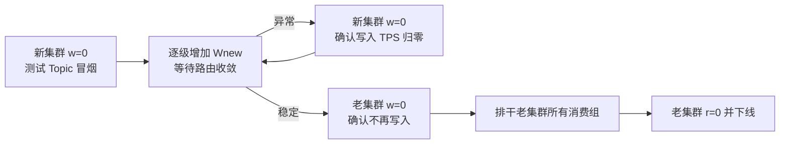

# RocketMQ 集群迁移的灰度放量方案

## 一句话结论

RocketMQ 没有按百分比放量的原生开关。普通消息可以通过新老 Broker 组的**总可写队列数**
近似控制流量比例，但队列数和权限都是客户端路由，不是 Broker 端的实时写入栅栏。迁移必须
包含路由收敛等待、老集群停写和存量排干三个阶段。

## 放量比例

Producer 默认在当前发布路由的全部可写 `MessageQueue` 上轮询，因此：

```text
新集群流量比例 ≈ Wnew / (Wold + Wnew)
```

其中 `Wnew`、`Wold` 是对应集群所有 Master 上 `writeQueueNums` 的总和。需要注意：

- `mqadmin updateTopic -c cluster-b -w N` 会给 `cluster-b` 的**每个 Master**配置 N 个写队列；
- 若新集群有 M 个 Master，则 `Wnew = M * N`，不是 N；
- 故障规避、发送重试、顺序选择器和业务自定义选择器都会使实际比例偏离理论值。

操作前应记录每个 Broker 当前完整的 `TopicConfig`。`updateTopic` 会创建一个新的配置对象，
未显式传入的 `perm`、`order`、unit 标志等会采用默认值。下面命令只适用于普通非顺序 Topic；
特殊 Topic 必须带上与原配置一致的 `-p`、`-o`、`-u`、`-s` 等参数。

## 推荐迁移步骤

以下用普通 Topic `NORMAL_TOPIC` 举例，并假设已经按 Master 数计算好每个阶段的总写队列数。
以下命令使用 `NAMESRV_ADDR` 指定 NameServer；请替换成实际地址。

### 第 1 步：准备新集群

新 Broker 使用新的 `clusterName`，注册到与老集群相同的 NameServer。先在新集群创建完整
Topic 配置，但保持 `writeQueueNums=0`：

```bash
export NAMESRV_ADDR=nameserver:9876

sh mqadmin updateTopic \
  -n "$NAMESRV_ADDR" \
  -t NORMAL_TOPIC -c cluster-b \
  -r 8 -w 0 -p 6 -o false
```

这使新集群队列对 Consumer 可见，但普通 Producer 的新路由不会选择它们。它只能验证注册、
订阅和 Rebalance，不能验证真实消息处理。真实消费链路应先用配置相同的专用测试 Topic 做
冒烟验证。

### 第 2 步：逐级增加新集群写队列

为每个阶段计算 `Wnew / (Wold + Wnew)`，再修改新集群每个 Master 的写队列数：

```bash
sh mqadmin updateTopic \
  -n "$NAMESRV_ADDR" \
  -t NORMAL_TOPIC -c cluster-b \
  -r 8 -w 1 -p 6 -o false

sh mqadmin updateTopic \
  -n "$NAMESRV_ADDR" \
  -t NORMAL_TOPIC -c cluster-b \
  -r 8 -w 2 -p 6 -o false
```

每个台阶至少等待 Producer 路由刷新并观察：新老集群写入 TPS、新集群消费延迟、失败率、
重试和死信。默认路由刷新周期是 30 秒，但网络异常和客户端暂停会延长收敛时间。

### 第 3 步：异常时停止继续放量

回退新集群发布路由：

```bash
sh mqadmin updateTopic \
  -n "$NAMESRV_ADDR" \
  -t NORMAL_TOPIC -c cluster-b \
  -r 8 -w 0 -p 6 -o false
```

该命令只影响后续刷新到新路由的 Producer。已经缓存旧路由的客户端和在途请求仍可能继续
发送，Broker 对普通发送也不会把 `writeQueueNums=0` 当作硬拒绝条件。因此不能宣称秒级、
瞬时停写；应等待至少一个路由刷新周期，并以新集群实际写入 TPS 归零作为收敛依据。

已经进入新集群的消息仍由 Consumer 排干。消费位点按 Consumer Group、Topic、Broker/Queue
维度维护，新老 Broker 上的积压需要分别观察。

### 第 4 步：完成最终切换

灰度稳定后，将老集群写队列改为 0，而不是仅把新集群队列增加到与老集群相同：

```bash
sh mqadmin updateTopic \
  -n "$NAMESRV_ADDR" \
  -t NORMAL_TOPIC -c cluster-a \
  -r 8 -w 0 -p 6 -o false
```

等待所有 Producer 路由收敛，并确认老集群写入 TPS 持续为零。由于路由控制不是硬栅栏，
需要严格切点时应先暂停或隔离 Producer、等待在途发送结束，再修改路由并恢复发送。

此后老集群才只有存量消息。等所有消费组的 lag 归零，再将老集群 `readQueueNums` 改为 0，
最后下线 Broker。不要在仍有积压时隐藏读队列。

## 特殊消息边界

- **顺序消息**：灰度期间同一 sharding key 可能落到新老两个复制组，跨组顺序无法保证。
  严格顺序 Topic 应暂停 Producer、等待在途发送和老队列消费完成、一次切换发布路由后再恢复；
  仅执行 `0 -> N` 并不能自动保序。
- **事务消息和定时消息**：内部事务状态、Half Topic、Timer 数据都位于具体 Broker，必须验证
  新集群配置并让老集群相关数据处理完成后再下线。
- **自动创建 Topic**：迁移期间应关闭 `autoCreateTopicEnable`，避免 Broker 按默认配置重新
  创建 Topic。
- **自定义队列选择**：任何依赖固定队列列表下标或 `hash(key) % queueCount` 的选择器都必须
  单独评估；改变队列集合会重映射 key。

## 流程总览



## 相关笔记

- [RocketMQ Read Queue 与 Write Queue](rocketmq_read_write_queue.md)
- [Producer MessageQueue 选择逻辑](producer-message-queue-selection.md)
- [RocketMQ Broker 路由注册机制](rocketmq_broker_route_registration.md)
- [RocketMQ 顺序消息：生产投递与因果顺序](rocketmq_ordered_message.md)
- [Push 并发消费：位点提交、重试与死信](rocketmq_concurrent_consume_offset.md)
