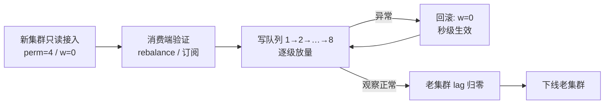

# RocketMQ 集群迁移的灰度放量方案

## 一句话结论

RocketMQ 原生没有"按百分比放量"的开关，但**生产者的流量分配本质上是按各 Broker 上的写队列数轮询的**，所以灰度的抓手就是两个：Broker/Topic 的权限（`perm`）+ 写队列数量（`writeQueueNums`）。两者都能通过 mqadmin 动态调整、30 秒内生效、可秒级回滚。

## 场景

生产环境迁移时，在原有 Name Server 集群中新增一套独立的 Broker 集群（新 `clusterName`），客户端从 NameServer 拿到的是新老两个集群合并后的路由。风险在于：流量一旦切过去，如果消费端没启动成功、订阅关系有问题，消息就会堆积。所以需要**先消费端验证、再逐步放量**，而不是一次性把流量全切过去。

## 放量的原理

生产者从 NameServer 拿到 Topic 的完整路由：老集群 8 个写队列 + 新集群 N 个写队列。默认负载均衡是在这些队列上轮询（配合故障规避，见 [Producer MessageQueue 选择逻辑](producer-message-queue-selection.md)），所以：

> 流到新集群的流量比例 ≈ 新集群写队列数 / 全部写队列数

控制这个比值，就等于控制了灰度比例。这与 [RocketMQ Read Queue 与 Write Queue](rocketmq_read_write_queue.md) 中的结论一致：**perm 决定"能不能"，queue nums 决定"能多少"**。

## 推荐迁移步骤

### 第 1 步：新集群以"只读"姿态接入

新 Broker 起新的 clusterName（如 `cluster-b`），注册到原有同一套 NameServer。关键是不让它承接写入：

```bash
# 新集群 Broker 配置文件里直接设（或运行时改）
brokerPermission=4          # 4=只读, 6=读写

# 或按 Topic 粒度控制（更推荐，影响面可控）
sh mqadmin updateTopicPerm -t ORDER_TOPIC -c cluster-b -p 4
```

此时消费者可以从新 Broker 分配到队列并完成 rebalance，但生产者不会往它写消息——**这正是规避"消费者没启动成功"风险的关键**：先让消费端在零流量状态下把启动、订阅、rebalance 全部验证一遍。

### 第 2 步：消费端先行验证

确认所有消费组在新集群上 rebalance 正常、订阅关系一致、客户端无报错。这一步没有任何流量风险，因为根本没消息进来。

### 第 3 步：按队列数逐步放量

用 mqadmin 动态调整新集群上该 Topic 的写队列数：

```bash
# 先放 1 个写队列（比如老集群 8 个，此时约 1/9 流量）
sh mqadmin updateTopic -t ORDER_TOPIC -c cluster-b -w 1 -r 8
# 观察无异常后再逐步加大
sh mqadmin updateTopic -t ORDER_TOPIC -c cluster-b -w 2 -r 8
# ...
sh mqadmin updateTopic -t ORDER_TOPIC -c cluster-b -w 8 -r 8
```

生产者默认每 30 秒（`pollNameServerInterval`）刷新一次路由，新队列数自动生效，不需要重启任何客户端。

### 第 4 步：观察 + 秒级回滚

每个放量台阶观察：新集群的消费延迟/堆积量、消费失败率、死信队列、生产者发送耗时。一旦异常：

```bash
# 回滚只需一条命令
sh mqadmin updateTopic -t ORDER_TOPIC -c cluster-b -w 0 -r 8
```

已经写进新 Broker 的消息不用担心：**消费组位点（offset）是 Broker 维度的，同一个消费组会同时消费新老两个集群**，新集群里的存量会被自然排干，不存在"消息丢了没人消费"的问题。

### 第 5 步：老集群流量排干后下线

新老集群天然是"按写入时间切分"的：老集群只有存量消息，消费完 lag 归零后，摘掉老 Broker 即可。下线单个 Broker 时同样遵守"先 write=0、消费排干、再 read=0"的顺序。

## 几个容易踩的坑

- **顺序消息**：`MessageQueueSelector` 是在"当前全部队列"里选的，灰度期间同一个 sharding key 的消息可能一部分落在老集群、一部分落在新集群，**跨集群的顺序性会被打破**。有严格顺序消息的 Topic，建议要么最后单独整批切（写队列 0→8 一步到位，老集群等存量排干再停写），要么用应用层方案。
- **事务消息 / 定时消息**：确认新集群版本和配置支持，且消费端能正确处理。
- **自动创建 Topic 要关掉**（`autoCreateTopicEnable=false`），否则路由权限不受控，灰度就失去意义了。

## 备选：应用层双 Topic 方案

如果要求灰度粒度更细（比如按用户 ID 尾号、按业务维度），可以新建 `ORDER_TOPIC_GRAY`，生产端在代码里根据配置中心的比例决定发老 Topic 还是灰度 Topic，消费端两个都订阅。缺点是侵入业务代码、消费订阅关系变复杂，优点是放量逻辑完全自己掌控，顺序性也好处理。成熟公司两条路都常见：常规 Topic 走队列数放量，强顺序/强业务维度的走双 Topic。

## 流程总览



## 相关笔记

- [RocketMQ Read Queue 与 Write Queue](rocketmq_read_write_queue.md) —— perm 与 read/write queue nums 的关系，优雅下线的原型
- [Producer MessageQueue 选择逻辑](producer-message-queue-selection.md) —— 生产者如何在 write 队列间轮询与故障规避
- [RocketMQ Broker 路由注册机制](rocketmq_broker_route_registration.md) —— 新集群注册到 NameServer 后路由如何合并下发
- [RocketMQ 顺序消息：生产投递与因果顺序](rocketmq_ordered_message.md) —— 顺序消息在灰度期被打断的原因
- [Push 并发消费：位点提交、重试与死信](rocketmq_concurrent_consume_offset.md) —— 消费组位点按 Broker 维度管理的细节
