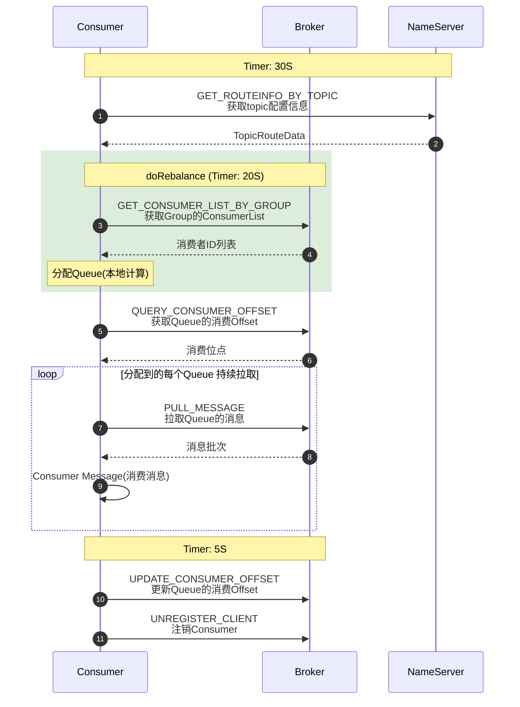

# RocketMQ Consumer 生命周期时序图（源码导读）

> 本文以一张经典的消费者时序图为线索，梳理 `DefaultMQPushConsumer` 从启动到关闭的
> 8 个关键步骤：每一步用哪个 RequestCode、由哪个定时任务驱动、源码在哪个类里。
> 图里的周期与请求码均已对照当前工作区源码核实。
> 更深入的逐行分析（rebalance 策略、拉取回调、流控、重试）请配合阅读：
> - [`consumer_flow_analysis.md`](consumer_flow_analysis.md) —— Push 消费全流程逐行解析

## 一、总览时序图



## 二、三个定时周期

图中的三个 Timer 全部来自客户端的周期任务，默认值集中在 `ClientConfig` 与
`RebalanceService`：

| 周期 | 配置项（默认值） | 驱动的动作 | 源码位置 |
| --- | --- | --- | --- |
| 30s | `pollNameServerInterval`（30000ms） | 拉取 topic 路由 `GET_ROUTEINFO_BY_TOPIC` | `ClientConfig.java:58`；任务注册在 `MQClientInstance.startScheduledTask()`（`MQClientInstance.java:341`） |
| 20s | `rocketmq.client.rebalance.waitInterval`（20000ms） | 触发 `doRebalance()` | `RebalanceService.java:25` |
| 5s | `persistConsumerOffsetInterval`（5000ms） | 批量持久化消费位点 `UPDATE_CONSUMER_OFFSET` | `ClientConfig.java:66`；任务注册在 `MQClientInstance.java:369` |

图中没有画出的还有心跳：`heartbeatBrokerInterval`（默认 30s，
`ClientConfig.java:62`），负责向所有 Broker 发送心跳，维持消费者注册状态。

## 三、逐请求分解

请求码定义于 `remoting/src/main/java/org/apache/rocketmq/remoting/protocol/RequestCode.java`。

### 1. GET_ROUTEINFO_BY_TOPIC（105）→ NameServer

消费者每 30s 从 NameServer 拉一次 topic 路由（队列数、分布在哪些 Broker）。
入口 `MQClientInstance.updateTopicRouteInfoFromNameServer()`，结果落在本地
`topicRouteTable` / `topicSubscribeInfoTable`，是后续 rebalance 的输入。

### 2. GET_CONSUMER_LIST_BY_GROUP（38）→ Broker

rebalance 需要知道**同一消费组现在有哪些成员**。客户端不维护组员视图，只能问
Broker（保存在 Broker 端 `ConsumerManager`）：

```java
// RebalanceImpl.rebalanceByTopic()  RebalanceImpl.java:297
List<String> cidAll = this.mQClientFactory.findConsumerIdList(topic, consumerGroup);
// → MQClientInstance.java:1316 → mQClientAPIImpl.getConsumerIdListByGroup(brokerAddr, ...)
```

### 3. 分配 Queue —— 本地计算，无 RPC

拿到「topic 全部队列 + 组内全部消费者」两个集合后，用分配策略（默认
`AllocateMessageQueueAveragely` 平均分配）在**客户端本地**算出自己该消费哪些队列。
这就是图中绿框 `doRebalance` 覆盖第 2、3 步的原因：它们同属 rebalance 流程，
而真正算队列这一步不发任何网络请求。

小细节：`RebalanceService` 里 `balanced ? waitInterval : minInterval`
（`RebalanceService.java:51-52`）——一轮 rebalance 结果不平衡时，1 秒后就重试，
平衡了才等满 20s。

### 4. QUERY_CONSUMER_OFFSET（14）→ Broker

rebalance 后新接管一个队列时，先查 Broker 端该队列上次消费到哪了（Broker 存于
`ConsumerOffsetManager`，落盘在 `consumerOffset.json`）。查不到则按
`consumeFromWhere`（`CONSUME_FROM_LAST_OFFSET / FIRST_OFFSET / TIMESTAMP`）计算
起始位点，见 `RebalancePushImpl.computePullFromWhere()`（`RebalancePushImpl.java:155`）。

### 5. PULL_MESSAGE（11）→ Broker

`PullMessageService` 独立线程循环地对每个分配到的队列发起拉取
（`PullMessageService.java:105` → `DefaultMQPushConsumerImpl.pullMessage()`），
拉回的消息进入 `ProcessQueue` 缓存并提交消费线程池。Push 消费者的"推"体验，
底层就是这条长轮询拉取链路。

### 6. UPDATE_CONSUMER_OFFSET（15）→ Broker，Timer: 5S

消费成功后位点**先更新内存**（`OffsetStore.updateOffset`），再由 5s 定时任务
`persistAllConsumerOffset()`（`MQClientInstance.java:562`）批量刷到 Broker。
**位点提交不是每条消息消费完就发一次 RPC**，因此重复消费的窗口约为 5 秒。

### 7. UNREGISTER_CLIENT（35）→ 仅 Broker

`consumer.shutdown()` 时向所有 Broker 发注销请求
（`MQClientInstance.java:1110-1122` 遍历 brokerAddrTable），Broker 从
`ConsumerManager` 清除该客户端与订阅关系。注意：**这个请求不会发给 NameServer**
——NameServer 只维护 Broker 级路由元数据，从不感知消费者个体，所以图中最后一步
没有连到 NameServer 的线。

## 四、设计要点

1. **NameServer 参与度极低**：全图只有第 1 步经过它。路由元数据在 NameServer，
   消息与消费状态全在 Broker 侧闭环，NameServer 无状态、互不通信的设计得以成立。
2. **三个 Timer 各司其职**：30s 保路由新鲜，20s 保队列分配均衡，5s 保位点持久化；
   日常运维说的"消费者最多 20s 完成一次扩缩容再平衡"就来自中间那个。
3. **两段式位点提交**：内存即时更新 + 5s 批量持久化，用 5 秒的重复消费窗口换掉了
   每条消息一次的 RPC 开销，`at-least-once` 语义由此而来。
4. **分配在客户端、组员名单在 Broker**：Broker 只回答"组里有哪些人"，"谁消费哪些
   队列"由每个消费者独立计算，Broker 不做集中分配——这是无 master 协调的
   去中心化 rebalance。

## 五、相关笔记

- [`consumer_flow_analysis.md`](consumer_flow_analysis.md) —— rebalance 策略、
  PullCallback、并发/顺序消费、流控与重试的逐行分析
- [`rocketmq_producer_broker_communication.md`](rocketmq_producer_broker_communication.md)
  —— Consumer 与 Producer 共用的 Remoting 通信层
- [`rocketmq_broker_route_registration.md`](rocketmq_broker_route_registration.md)
  —— Broker → NameServer 路由注册，即第 1 步路由数据的来源
