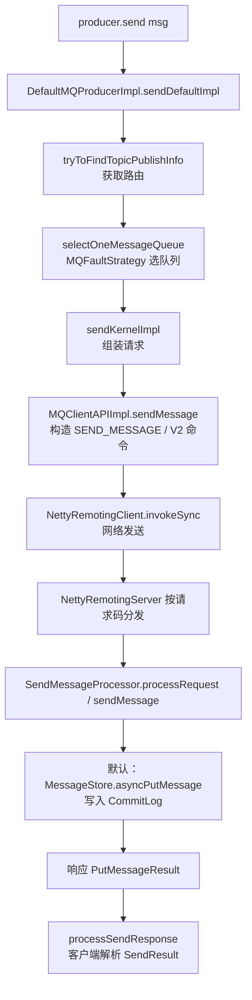

# RocketMQ 消息发送链路速览（源码导读）

> 本文是消息发送链路的**速览版导读**：以同步发送为主线，给出整体流程图、关键代码位置、
> 三种通信模式对比、SendStatus 映射与关键设计总结。
> 结论以当前工作区源码为准；图中的 Broker 异步分支对应默认开启的 `asyncSendEnable`。
> 需要更细致的逐行分析请配合阅读：
> - [`rocketmq_producer_send_source_flow.md`](rocketmq_producer_send_source_flow.md) —— Producer 端全链路逐行解析
> - [`rocketmq_broker_receive_message_processing.md`](rocketmq_broker_receive_message_processing.md) —— Broker 端接收处理
> - [`producer-message-queue-selection.md`](producer-message-queue-selection.md) —— MessageQueue 选择逻辑

## 一、整体流程图



## 二、客户端阶段

### 1. 入口：`DefaultMQProducerImpl.send()` → `sendDefaultImpl()`

文件：`client/src/main/java/org/apache/rocketmq/client/impl/producer/DefaultMQProducerImpl.java`（738 行起）

```java
private SendResult sendDefaultImpl(Message msg, CommunicationMode communicationMode,
    SendCallback sendCallback, final long timeout) {
    this.makeSureStateOK();
    Validators.checkMessage(msg, this.defaultMQProducer);   // 校验 topic/body 长度
    ...
    TopicPublishInfo topicPublishInfo = this.tryToFindTopicPublishInfo(msg.getTopic());
    if (topicPublishInfo != null && topicPublishInfo.ok()) {
        // 同步模式重试次数 = 1 + retryTimesWhenSendFailed(默认 2,即最多 3 次)
        int timesTotal = communicationMode == CommunicationMode.SYNC ?
            1 + this.defaultMQProducer.getRetryTimesWhenSendFailed() : 1;
        for (; times < timesTotal; times++) {
            MessageQueue mqSelected = this.selectOneMessageQueue(topicPublishInfo, lastBrokerName, resetIndex);
            ...
            sendResult = this.sendKernelImpl(msg, mq, communicationMode, sendCallback,
                topicPublishInfo, curTimeout);
            ...
        }
    }
}
```

关键点：

- **超时预算递减**：每次重试用 `curTimeout = timeout - costTime`，总预算来自
  `sendMsgTimeout`（默认 3s）。若仍有下一次同步重试，`sendMsgMaxTimeoutPerRequest`（默认 `-1`，不限制）会限制本次请求的最大超时，从而为后续重试保留预算。
- **异常分类处理**：
  - `RemotingException` → 立即再次选择队列并重试；选择器会尽量避开上次 Broker，但不保证一定换到其他 Broker；
  - `MQBrokerException` → 只有响应码在 `retryResponseCodes` 中才重试；
  - `InterruptedException` → 直接抛出，不重试。

### 2. 路由发现：`tryToFindTopicPublishInfo()`(894 行)

```java
private TopicPublishInfo tryToFindTopicPublishInfo(final String topic) {
    TopicPublishInfo topicPublishInfo = this.topicPublishInfoTable.get(topic);
    if (null == topicPublishInfo || !topicPublishInfo.ok()) {
        this.mQClientFactory.updateTopicRouteInfoFromNameServer(topic);  // 从 NameServer 拉取路由
        ...
    }
}
```

- 本地缓存(`topicPublishInfoTable`)不存在或为空（`ok()` 只要求发布队列列表非空）时，
  向 NameServer 发送 `GET_ROUTEINFO_BY_TOPIC`(105)请求拉取路由。
- 路由信息包含 Broker 地址表和该 Topic 的所有 `MessageQueue` 列表。

### 3. 队列选择:`MQFaultStrategy.selectOneMessageQueue()`

文件：`client/src/main/java/org/apache/rocketmq/client/latency/MQFaultStrategy.java`

- **故障规避开启**(`sendLatencyFaultEnable=true`):按"可用性过滤 + Broker 隔离"选队列。
  默认阈值中，延迟 `>= 550ms` 隔离 2 秒，`>= 15000ms` 隔离 30 秒。
- **默认关闭**：随机递增取模轮询 `messageQueueList`;重试时通过 `lastBrokerName`
  尽量避开上次失败的 Broker。

### 4. 组装请求:`sendKernelImpl()`(911 行)

```java
String brokerAddr = this.mQClientFactory.findBrokerAddressInPublish(brokerName);
...
MessageClientIDSetter.setUniqID(msg);          // 生成 UNIQ_KEY(客户端唯一 ID)
if (this.tryToCompressMessage(msg)) { ... }    // body >= 4KB 时压缩
// 构建 SendMessageRequestHeader: producerGroup/topic/queueId/sysFlag/properties...
```

做了这些事：

1. 由 `MessageQueue` 找到 brokerName → brokerAddr(找不到则再拉一次路由)
2. 设置 `UNIQ_KEY`、命名空间、压缩标志、事务半消息标志
3. 执行 `CheckForbiddenHook` / `SendMessageHook`(before)
4. 按 SYNC/ASYNC 分发到 `MQClientAPIImpl.sendMessage()`

### 5. 网络层:`MQClientAPIImpl.sendMessage()`

文件：`client/src/main/java/org/apache/rocketmq/client/impl/MQClientAPIImpl.java`(534 行起)

```java
if (sendSmartMsg || msg instanceof MessageBatch) {
    request = RemotingCommand.createRequestCommand(
        msg instanceof MessageBatch ? RequestCode.SEND_BATCH_MESSAGE : RequestCode.SEND_MESSAGE_V2,
        requestHeaderV2);   // V2 用字段索引代替字符串 key,减小包体
}
request.setBody(msg.getBody());
```

三种通信模式：

| 模式 | 实现 | 特点 |
|------|------|------|
| SYNC | `invokeSync` + 倒计时锁等待响应 | 失败可内部重试 |
| ASYNC | `invokeAsync` + `InvokeCallback` | 传输异常或响应解析为异常时由 `onExceptionImpl` 重试（`retryTimesWhenSendAsyncFailed`）；收到非 `SEND_OK` 的正常响应会回调成功并携带该状态 |
| ONEWAY | `invokeOneway`,不等待响应 | 无重试、无结果 |

最终由 `NettyRemotingClient` 通过 Netty Channel 写出，协议为自研 Remoting 协议(Header + Body)。

## 三、Broker 端阶段

### 6. 请求分发:`SendMessageProcessor.processRequest()`

文件：`broker/src/main/java/org/apache/rocketmq/broker/processor/SendMessageProcessor.java`

- 先为静态 Topic 建立上下文并执行 `rewriteRequestForStaticTopic`，随后调用 `sendMessage()` 中的 **前置校验**(`preSend`)：Broker 是否可写、Topic 是否存在、写权限和队列编号等
- `rejectRequest()` 在未启用 Slave acting master 的 Slave，或 PageCache 繁忙、TransientStorePool 不足时拒绝请求

### 7. 核心处理:`sendMessage()`(243 行)

```java
MessageExtBrokerInner msgInner = new MessageExtBrokerInner();
msgInner.setBody(body);
msgInner.setBornHost(ctx.channel().remoteAddress());   // 客户端地址
msgInner.setStoreHost(this.getStoreHost());           // broker 地址
msgInner.setTagsCode(...);                             // tag hash 用于 ConsumeQueue 过滤
...
if (brokerController.getBrokerConfig().isAsyncSendEnable()) {
    CompletableFuture<PutMessageResult> future =
        this.brokerController.getMessageStore().asyncPutMessage(msgInner);
    future.thenAcceptAsync(putMessageResult -> {
        handlePutMessageResult(...);   // PUT_OK / FLUSH_DISK_TIMEOUT / SLAVE_NOT_AVAILABLE...
        doResponse(ctx, request, responseFuture);
    }, this.brokerController.getPutMessageFutureExecutor());
    return null;  // 返回 null 释放 Netty IO 线程
}
```

要点：

- 重试消息(`%RETRY%` 前缀)走 `handleRetryAndDLQ`,超过最大重试次数则转死信 Topic `%DLQ%`
- 事务半消息(`TRANSACTION_PREPARED_TYPE`)走 `TransactionalMessageService.asyncPrepareMessage`,
  存入特殊 topic `RMQ_SYS_TRANS_HALF_TOPIC`
- `asyncSendEnable` 默认开启，控制的是 Broker 对发送请求的异步处理，不是刷盘模式。该分支在存储 future 完成后由 `putMessageFutureExecutor` 回写响应，避免阻塞 Netty IO 线程；关闭该开关时调用同步 `putMessage()`。

### 8. 存储层:`DefaultMessageStore.asyncPutMessage()`

文件：`store/src/main/java/org/apache/rocketmq/store/DefaultMessageStore.java`

消息进入**单个 Broker** 的 CommitLog 映射文件序列（该 Broker 上的 Topic/队列共用），之后由后台线程异步构建：

- **ReputMessageService** → 分发到 `ConsumeQueue`(消费索引)和 `IndexFile`(按 Key 查询索引)
- `SYNC_FLUSH` 使用 `GroupCommitService` 等待刷盘；`ASYNC_FLUSH` 使用 `FlushRealTimeService`。副本确认由存储层所需 ack 数决定；刷盘或副本等待超时会产生对应的 `SendStatus`

## 四、响应回程

Broker 返回的 ResponseCode 映射为 `SendStatus`(`processSendResponse`):

| ResponseCode | SendStatus | 说明 |
|---|---|---|
| `SUCCESS` | `SEND_OK` | 成功 |
| `FLUSH_DISK_TIMEOUT` | `FLUSH_DISK_TIMEOUT` | 刷盘超时(**消息可能已落盘成功**) |
| `FLUSH_SLAVE_TIMEOUT` | `FLUSH_SLAVE_TIMEOUT` | 主从同步超时(同上) |
| `SLAVE_NOT_AVAILABLE` | `SLAVE_NOT_AVAILABLE` | Slave 不可用 |
| 其他错误码 | 抛 `MQBrokerException` | 仅响应码属于 `retryResponseCodes` 时，`sendDefaultImpl()` 才重试 |

注意：非 `SEND_OK` 状态下消息可能实际已写入成功，只是没在超时内确认；此时客户端重试会产生重复消息，需要消费端幂等。

## 五、关键设计总结

1. **重试与容错**:SYNC 对可重试异常和 `retryResponseCodes` 中的响应码最多尝试 3 次；每次重新选队列并尽量避开上次 Broker。非 `SEND_OK` 的成功响应是否重试由 `retryAnotherBrokerWhenNotStoreOK` 决定，默认关闭
2. **超时贯穿全程**：从 `send()` 到网络层逐级扣减剩余时间，保证总超时可控
3. **顺序写 CommitLog**:同一 Broker 的消息混合顺序写入 CommitLog 文件序列，消费索引异步构建
4. **Hook 机制**:`SendMessageHook` 支持消息轨迹(trace)等扩展能力
