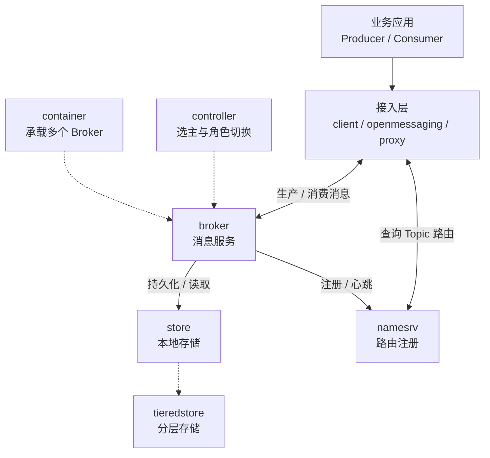

# RocketMQ 模块总览

本文按根目录 [pom.xml](../pom.xml) 当前声明的 18 个 Maven 模块整理，说明每个模块在项目中的职责和主要代码入口。

## 一、整体运行链路

下面只展示运行时主链路；`common`、`remoting`、`filter`、`auth`、`srvutil` 等共享或横切模块在后文单独说明。

## 二、核心运行模块

### 1. `client`

Java 客户端 SDK，面向业务应用提供生产、消费和管理 API。

- 提供同步、异步、单向、请求/响应和事务消息发送。
- 提供 Push、Pull、LitePull、POP 等消费方式，以及消费组再均衡、位点管理和 ACK。
- 实现发送重试、故障规避、延时/顺序/批量消息支持、客户端钩子和消息轨迹。

主要入口：[DefaultMQProducer.java](../client/src/main/java/org/apache/rocketmq/client/producer/DefaultMQProducer.java)。

### 2. `common`

全项目共享的基础库，不启动独立业务服务。它集中放置各模块共用的领域模型和基础能力，包括：

- Message、Topic、Queue、订阅、Broker 和消费者等数据模型。
- 配置对象、协议常量、系统标志、版本信息和资源定义。
- 序列化、压缩、线程/生命周期、统计指标、日志和通用工具。
- NameServer、Broker、Controller 等组件的公共配置定义。

典型入口：[TopicConfig.java](../common/src/main/java/org/apache/rocketmq/common/TopicConfig.java)。

### 3. `broker`

Broker 服务端核心，负责承接客户端和管理端请求，并协调消息服务的各个子系统。

- 接收消息生产、拉取、POP、ACK、回复和查询请求。
- 管理 Topic、订阅组、消费者连接、消费位点和队列分配。
- 处理长轮询、消费重试/死信、延时/定时消息、事务消息、顺序消费、限流和指标。
- 调用 `store` 完成消息持久化，并接入 HA、Controller、鉴权、过滤、插件和分层存储能力。

启动入口：[BrokerStartup.java](../broker/src/main/java/org/apache/rocketmq/broker/BrokerStartup.java)；核心协调类是 `BrokerController`。

### 4. `store`

本地消息存储引擎，由 Broker 调用完成消息写入、读取、索引和恢复。

- `CommitLog`：顺序保存消息主体。
- `ConsumeQueue`、批量队列和 `IndexFile`：构建消费与查询索引。
- 负责刷盘、MappedFile 管理、文件清理、故障恢复、消息查询和存储统计。
- 包含 RocksDB 存储、压缩/Compaction、事务/定时消息相关存储，以及 Master/Slave 和自动切换复制实现。

主要接口和实现：[DefaultMessageStore.java](../store/src/main/java/org/apache/rocketmq/store/DefaultMessageStore.java)。

### 5. `namesrv`

NameServer 路由注册服务。它维护 Broker、Topic、Queue 的路由信息，接收 Broker 注册和心跳，清理失效节点，并向 Producer/Consumer 提供 Topic 路由查询；同时提供 NameServer KV 配置管理。

NameServer 进程可以配置为嵌入 Controller。启动入口：[NamesrvStartup.java](../namesrv/src/main/java/org/apache/rocketmq/namesrv/NamesrvStartup.java)。

### 6. `controller`

Broker 副本组的高可用控制平面。

- 使用 DLedger/JRaft 等一致性日志保存副本元数据。
- 管理 Broker 注册、Broker ID、心跳、`SyncStateSet`、`MasterEpoch` 等状态。
- 监测 Broker 存活状态，在 Master 故障时按策略选举新的 Master。
- 将选举结果和角色变化通知 Broker，驱动主从切换和复制边界更新。
- 支持独立部署，也支持嵌入 NameServer。

启动入口：[ControllerStartup.java](../controller/src/main/java/org/apache/rocketmq/controller/ControllerStartup.java)。

### 7. `remoting`

RocketMQ 的底层远程通信和 RPC 协议库，被客户端、Broker、NameServer、Controller 和 Proxy 共同使用。

- 基于 Netty 提供 RemotingClient、RemotingServer 和连接管理。
- 定义请求/响应命令、Header、Body、序列化和协议编解码。
- 支持同步、异步、单向调用、处理器注册、回调、RPC Hook、TLS 和代理连接。

典型入口：[NettyRemotingServer.java](../remoting/src/main/java/org/apache/rocketmq/remoting/netty/NettyRemotingServer.java)。

### 8. `srvutil`

服务端通用启动辅助库，提供命令行参数和属性处理、配置文件监听、关闭钩子以及服务生命周期相关工具。它不承载具体消息业务。

典型入口：[ServerUtil.java](../srvutil/src/main/java/org/apache/rocketmq/srvutil/ServerUtil.java)。

## 三、功能扩展与接入模块

### 9. `filter`

消息过滤表达式库，供 Broker 在投递消息前执行条件判断。

- 提供 Filter SPI、工厂和过滤表达式模型。
- 解析并执行 SQL92 订阅表达式，包含比较、逻辑、集合和时间表达式。
- 提供 BloomFilter 等辅助结构，减少重复执行复杂表达式的开销。

主要入口：[SqlFilter.java](../filter/src/main/java/org/apache/rocketmq/filter/SqlFilter.java)。

### 10. `auth`

统一认证与授权库，负责识别访问主体并判断其对资源的操作权限。

- 提供用户/主体认证、ACL 和策略授权模型。
- 提供上下文构建、Provider、Manager、Stateful/Stateless 策略和元数据管理。
- 包含旧版 ACL 配置迁移能力，供 Broker、Proxy 等接入层复用。

典型入口：[AuthenticationEvaluator.java](../auth/src/main/java/org/apache/rocketmq/auth/authentication/AuthenticationEvaluator.java)。

### 11. `proxy`

无状态协议代理和流量接入层，为非 Java 或希望使用统一协议入口的客户端提供服务。

- 当前提供 gRPC/Protobuf 接入，并支持 RocketMQ Remoting 和多协议扩展。
- 将生产、消费、ACK、事务、路由等请求转换为 Broker/NameServer 调用。
- 支持 Cluster/Local 部署、POP 消费、TLS、认证授权、连接管理、流量治理、指标和追踪。

启动入口：[ProxyStartup.java](../proxy/src/main/java/org/apache/rocketmq/proxy/ProxyStartup.java)；模块说明见 [proxy/README.md](../proxy/README.md)。

### 12. `tieredstore`

分层消息存储插件，README 将其标为 Technical preview。它作为 Broker 的 `MessageStore` 插件，将较冷的消息和索引按策略转移到更便宜、更大容量的后端。

- 管理分层存储元数据、文件段、索引和读取缓存。
- 支持默认 POSIX 文件后端，并保留可插拔后端扩展点。
- 提供数据上传、回源读取、TTL 和保留时间等策略。

主要入口：[TieredMessageStore.java](../tieredstore/src/main/java/org/apache/rocketmq/tieredstore/TieredMessageStore.java)；使用说明见 [tieredstore/README.md](../tieredstore/README.md)。

### 13. `container`

BrokerContainer 运行模式，使一个进程可以承载多个相互独立的 Broker。

- 多个 Broker 共享 RemotingServer、网络连接和部分进程资源。
- 管理内嵌 Broker 的启动、停止、配置和请求分发。
- 支持通过管理命令运行时增加、移除或更新 Broker，并适配主从/DLedger 等部署形态。
- 用于提高单节点资源利用率，并支持多磁盘和对等混部部署。

启动入口：[BrokerContainerStartup.java](../container/src/main/java/org/apache/rocketmq/container/BrokerContainerStartup.java)；设计说明见 [BrokerContainer.md](../docs/cn/BrokerContainer.md)。

### 14. `openmessaging`

OpenMessaging API 适配层，将 OpenMessaging 标准接口映射到 RocketMQ Java 客户端。

- 实现 MessagingAccessPoint、Producer、Push/Pull Consumer、Message 和 Promise 等接口。
- 负责标准 API 对象与 RocketMQ 客户端对象之间的转换。

典型入口：[MessagingAccessPointImpl.java](../openmessaging/src/main/java/io/openmessaging/rocketmq/MessagingAccessPointImpl.java)。

## 四、运维、测试与发布模块

### 15. `tools`

运维管理、诊断和监控工具，核心命令是 `mqadmin`。

- 提供 Admin API 和大量子命令，管理 Topic、订阅组、消费位点、Broker、NameServer、Controller、HA、Container 和 ACL。
- 支持消息查询、路由查看、状态/指标检查、配置更新、重置位点和故障处理。
- 包含部分监控服务和管理端结果模型。

命令入口：[MQAdminStartup.java](../tools/src/main/java/org/apache/rocketmq/tools/command/MQAdminStartup.java)。

### 16. `test`

可复用的测试支持库，不是线上运行服务。它封装测试 Producer/Consumer、消息工厂、监听器、数据采集、等待/断言、随机数据和测试辅助客户端，供单元测试、集成测试和部分基准测试使用。

典型测试工具：[ProducerFactory.java](../test/src/main/java/org/apache/rocketmq/test/factory/ProducerFactory.java)。

### 17. `distribution`

发行版打包模块，是一个聚合/组装模块而非业务运行时。

- 通过 Maven Assembly 组装 Broker、NameServer、Controller、Proxy、Container、Client、Tools 等产物。
- 打包启动脚本、配置文件、依赖和示例，生成可直接部署的 RocketMQ 二进制发行包。
- `distribution/bin` 提供 `mqbroker`、`mqnamesrv`、`mqcontroller`、`mqproxy`、`mqadmin` 等命令。

模块入口：[distribution/pom.xml](../distribution/pom.xml)。

### 18. `example`

示例与演示代码，用于学习 API 和验证部署，不参与核心服务运行。示例覆盖普通、异步、单向、顺序、事务、延时/定时、批量、过滤、广播、POP/LMQ、请求响应、消息轨迹、命名空间、ACL 和 OpenMessaging 等场景。

入门示例：[Producer.java](../example/src/main/java/org/apache/rocketmq/example/quickstart/Producer.java)。

## 五、辅助目录

- `docs`：概念、架构、设计、部署、运维和示例文档。
- `dev`：开发和贡献流程相关脚本。
- `style`：版权、格式和静态检查相关资源。
- `bazel` 与各目录下的 `BUILD.bazel`：Bazel 构建描述。
- `.github`：CI 工作流、Issue 模板和项目自动化配置。

根项目的 `rocketmq-all` 是 Maven 父/聚合 POM，用于统一版本、依赖和构建，不对应一个独立的线上服务。
