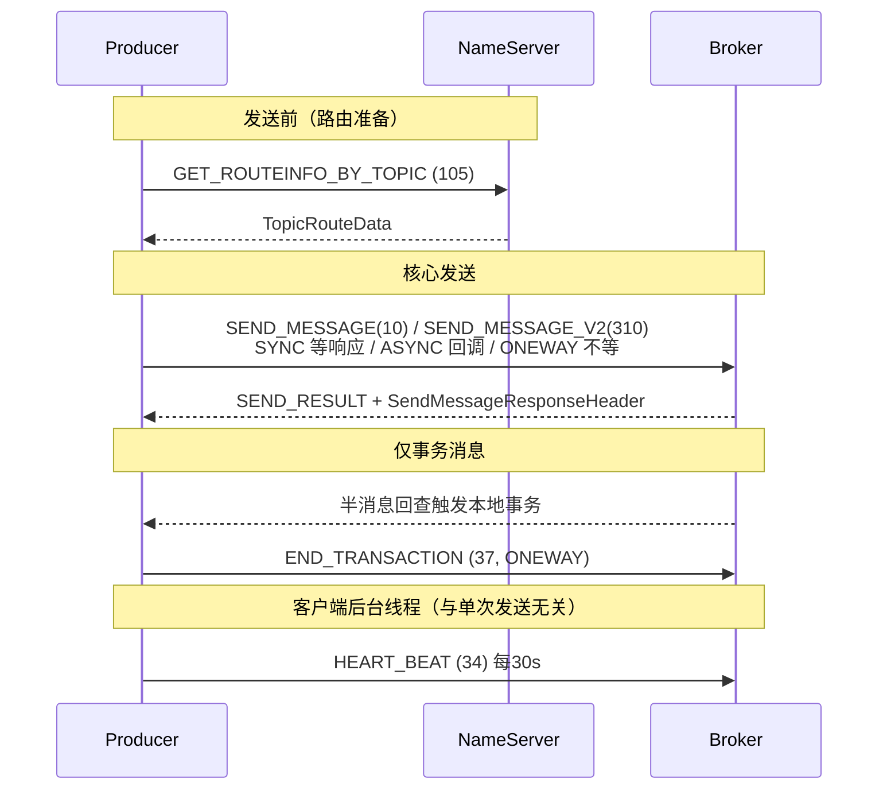

# RocketMQ Producer 与 Broker/NameServer 的通信全景

本文回答一个问题：**生产者在发送消息的完整过程中，会和 Broker（以及 NameServer）发生哪些通信？**

核心结论：一次普通消息发送，Producer 与 Broker 只有一次请求-响应：`SEND_MESSAGE`（code=10）或 `SEND_MESSAGE_V2`（code=310）。其余通信都是围绕这次发送的前置、后置或特殊场景。

## 全景图

## 1. 发送前：与 NameServer 的通信

- `GET_ROUTEINFO_BY_TOPIC`（105）：本地路由缓存不存在/过期时，由 `tryToFindTopicPublishInfo` 触发。消息正文**不经过** NameServer。
- 若 topic 不存在且允许自动创建，会先发一条到系统默认 topic `TBW102` 所在 Broker。

## 2. 核心：与 Broker 的发送通信

入口在 `client/src/main/java/org/apache/rocketmq/client/impl/MQClientAPIImpl.java` 的 `sendMessage`：

| 模式 | Remoting 调用 | Broker 处理器 |
| --- | --- | --- |
| SYNC | `NettyRemotingClient.invokeSync` | `SendMessageProcessor.processRequest` |
| ASYNC | `invokeAsync` + `SendCallback` | 同上 |
| ONEWAY | `invokeOneway` | 同上，无响应 |

- 请求体：`SendMessageRequestHeader`（topic、queueId、sysFlag、bornTimestamp、UNIQ_KEY 等）+ 消息 body；批量消息走 `SEND_BATCH_MESSAGE`(320)/V2。
- 响应：`SendResult`（含 `msgId`——客户端生成的 UNIQ_KEY，以及 `offsetMsgId`——Broker 生成的物理 offset id、`queueOffset`——CommitLog 分配的队列偏移）。
- 重试边界：SYNC 默认重试 2 次、共尝试 3 次（`retryTimesWhenSendFailed=2`，每次重新选队列，可能换 Broker）；ASYNC 在 remoting 层失败时也可换 Broker 重试（`retryTimesWhenSendAsyncFailed=2`）；ONEWAY 无任何重试与结果。

## 3. 特殊场景附加通信

- **事务消息**：半消息发送成功后，Producer 执行本地事务，再向 Broker 发 `END_TRANSACTION`（37，ONEWAY，见 `DefaultMQProducerImpl.endTransaction` → `endTransactionOneway`）；回查时 Broker 反向向 Producer 发 `CHECK_TRANSACTION_STATE` 请求。
- **查询类**（非发送必需，但属于 Producer 可对 Broker 发起的）：`QUERY_MESSAGE`(12)、`VIEW_MESSAGE_BY_ID`(33)、`SEARCH_OFFSET_BY_TIMESTAMP`、`GET_MAX_OFFSET`(30) 等，见 `MqClientAdminImpl` / `MQClientAPIImpl`。

## 4. 与单次发送无关但持续存在的通信

- `HEART_BEAT`（34）：`MQClientInstance` 每 30s 向所有 Broker 注册客户端信息（Producer 无消费信息也注册）。
- 关闭时 `unregisterClient`。

## 小结

普通发送 = 1 次 NameServer 路由查询（可缓存省略）+ N 次（含重试）对 Broker 的 `SEND_MESSAGE(_V2)` 请求-响应；事务消息额外多一次 `END_TRANSACTION` ONEWAY。

详细调用链参见 [Producer 发送消息源码全链路](rocketmq_producer_send_source_flow.md)。
