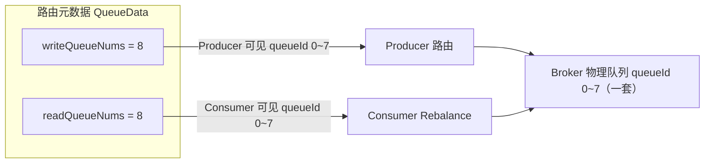

# RocketMQ Read Queue 与 Write Queue

## 一句话结论

read queue / write queue 不是两套物理队列，而是同一个 Topic 在路由元数据里的两个独立"计数器"——**write 队列数决定生产者能往哪些队列发，read 队列数决定消费者能从哪些队列消费**。拆开之后，就可以独立地调整"收消息的能力"和"发消息的能力"。

## 代码中的定义

源码位置：`common/src/main/java/org/apache/rocketmq/common/TopicConfig.java`

```java
public class TopicConfig {
    public static int defaultReadQueueNums = 16;
    public static int defaultWriteQueueNums = 16;

    private int readQueueNums;   // 消费者可见的队列数
    private int writeQueueNums;  // 生产者可见的队列数
}
```

NameServer 下发路由时，每个 Broker 对应一条 `QueueData`，里面分别携带 read / write 两个队列数。客户端拿到路由后的用法（`client/src/main/java/org/apache/rocketmq/client/impl/factory/MQClientInstance.java`）：

```java
// 生产者路由：TopicPublishInfo 按 writeQueueNums 构建可发送队列
for (int i = 0; i < qd.getWriteQueueNums(); i++) {
    MessageQueue mq = new MessageQueue(topic, qd.getBrokerName(), i);
    info.getMessageQueueList().add(mq);
}

// 消费者订阅信息：按 readQueueNums 构建，且要求 perm 可读
for (int i = 0; i < qd.getReadQueueNums(); i++) {
    MessageQueue mq = new MessageQueue(topic, qd.getBrokerName(), i);
    mqList.add(mq);
}
```

- **发送端**：Producer 做负载均衡、选队列发消息，只在 write 队列范围内选。
- **消费端**：Consumer 做 Rebalance 分配队列，只在 read 队列范围内分。

## 本质：同一套存储的两个视角

底层存储（CommitLog / ConsumeQueue）只有一套，queueId 0~N 是共享的。read/write queue nums
是路由元数据中的可见范围，不会自动创建、删除或重新分片 Broker 上的 ConsumeQueue 文件：



## 为什么要区分

核心诉求：**生产能力和消费能力的变化频率、原因完全不同，希望能独立调整而互不影响**。典型场景：

### 1. 优雅下线 Broker（最常用）

要把某台 Broker 摘掉时，通常先把它的 write 队列数改成 0，并把 perm/客户端路由作为辅助
控制手段：

- 新路由收敛后 Producer 不再选择它的写队列；旧路由和在途请求仍可能继续到达，不能把
  `writeQueueNums=0` 当作服务端硬停写栅栏；
- Consumer 还能继续把它上面积压的消息消费完；
- 等积压清零，再把 read 队列数改成 0，最后下线。

如果读写不分离，这一步就没法平滑做——要么丢消息，要么消息卡死。

### 2. 独立扩缩容

- 想提升消费吞吐：优先加消费者；只有目标 queueId 已存在且有数据、此前被 read 范围隐藏时，
  增大 read 队列数才会让 Rebalance 纳入更多队列。它不会把已有消息重新分片；
- 想临时限制生产端：缩小 write 队列数即可。

两个方向的操作互不干扰。

### 3. 配合 perm 使用

`perm`（`PermName.PERM_READ = 4`，`PERM_WRITE = 2`）是开关，read/write queue nums 是刻度：

- perm 决定"能不能"；
- queue nums 决定"能多少"。

例如 perm = 只读时，write 队列数再多 Producer 也不可见。

## 一个坑

两个数指同一个 queueId 空间，**正常情况必须相等**。如果把 readQueueNums 改小而 writeQueueNums 不动：

- Producer 仍然会往 queueId ≥ readQueueNums 的队列写消息；
- Consumer 永远看不到这些队列；
- 消息会无限积压且无法消费。

所以运维上改这两个数要结合消息流向操作：下线或迁移时可以暂时 `write=0, read>0` 先停
新路由、再排干存量；普通 Topic 长期应让读范围覆盖所有实际写入的 queueId。修改后还要
等待客户端路由刷新，并观察实际写入 TPS，而不能仅凭命令返回成功判断已经生效。

## 相关笔记

- [MessageQueue 概念详解](messagequeue-concept.md) —— 队列的逻辑标识本身
- [RocketMQ Broker 路由注册机制](rocketmq_broker_route_registration.md) —— QueueData / TopicConfig 如何注册到 NameServer
- [Producer MessageQueue 选择逻辑](producer-message-queue-selection.md) —— Producer 如何在 write 队列中做选择
- [RocketMQ DefaultMQPushConsumer Pull 消费流程分析](consumer_flow_analysis.md) —— Consumer 如何在 read 队列上消费
