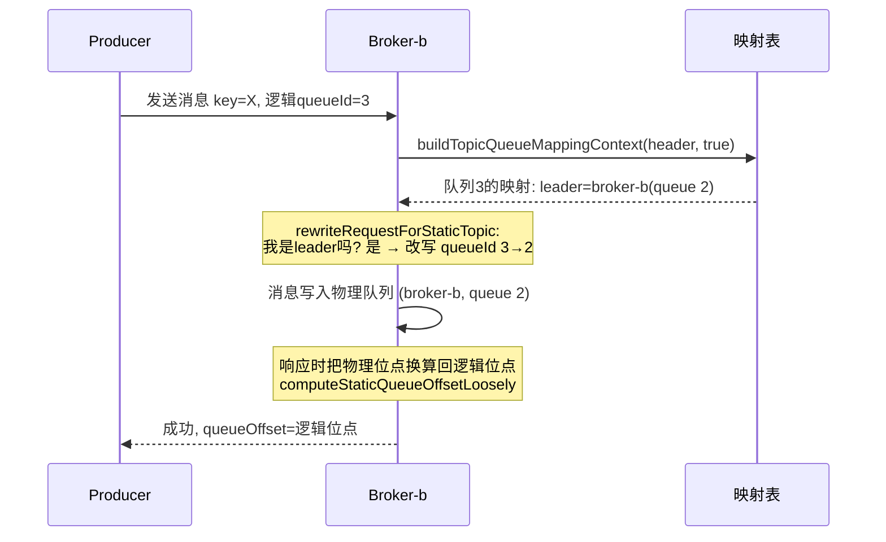
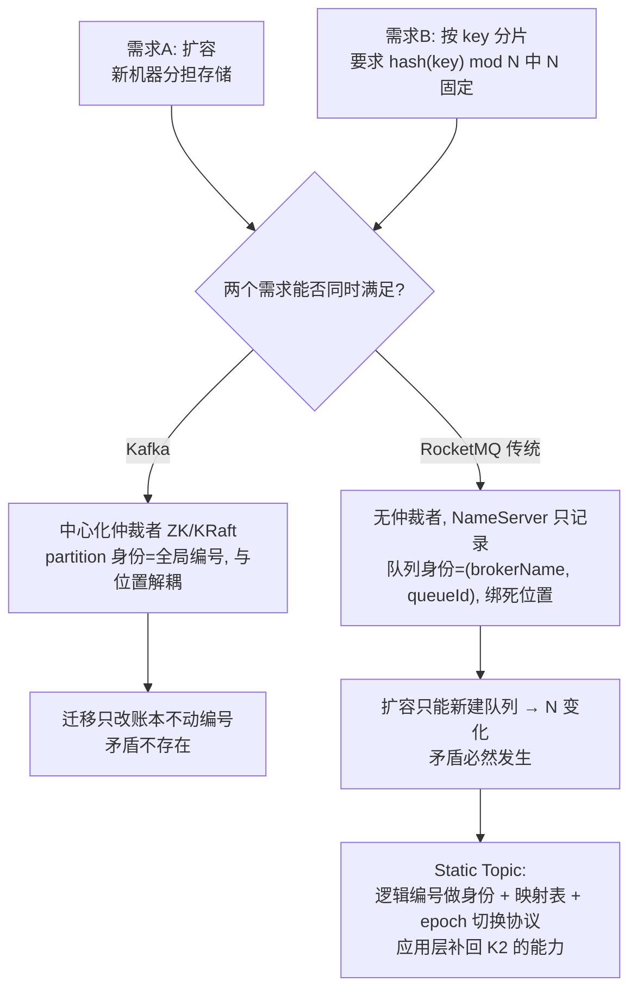

# RocketMQ 静态主题（Static Topic / Logic Queue）教学文档

> 本文整理自对 `docs/cn/statictopic/RocketMQ_Static_Topic_Logic_Queue_设计.md`、
> `TopicQueueMappingManager`、`SendMessageProcessor`、`LogicQueueMappingItem` 等源码的阅读，
> 从最基础的背景知识出发，回答一条完整的疑问链：
>
> 1. `buildTopicQueueMappingContext(requestHeader, true)` 这行代码是什么意思？
> 2. 静态主题是什么？为什么需要它？
> 3. 为什么 Kafka 的 partition 数固定后可以放心按 key 分区，而 RocketMQ 传统队列做不到"数量固定但存储可迁移"？
> 4. RocketMQ 使用 Static Topic 是怎么解决这个问题的？代价是什么？普通应用会用吗？

---

## 第一章 背景知识：理解问题的地基

### 1.1 消息系统的三个角色

- **Producer**：生产消息的程序
- **Broker**：服务器，负责**存储**消息。消息真正存在 Broker 的磁盘上
- **Consumer**：消费消息的程序

消息按 **Topic** 分类（比如 `order-events` 这个 Topic 存所有订单事件）。

### 1.2 为什么一个 Topic 要分成多个"队列"

如果 Topic 只有一条队伍，所有消息排一队，读写只能串行，吞吐量太低。所以把 Topic
横向切成 N 个队列（Kafka 叫 Partition，RocketMQ 叫 Queue），不同队列可以：

- 分布在**不同的机器**上 → 存储容量和吞吐量随机器数扩展；
- 被**并行**读写 → 生产者同时往多个队列写，消费者同时从多个队列拉。

这个"队列"就是系统的**并行单元和分布单元**。本文所有讨论都围绕一个问题：
**这 N 个队列，怎么管理？**

### 1.3 队列的本质是磁盘上的文件

这是最容易被忽略的一点：**队列不是抽象概念，它就是某台机器硬盘上的文件。**

- RocketMQ：每个队列对应一个 ConsumeQueue 索引文件 + CommitLog 里的数据段；
- Kafka：每个 partition 对应磁盘上一个目录，里面是一段一段的 log 文件。

所以"把队列从 A 机器搬到 B 机器"永远意味着一件事：
**把文件复制过去，并且保证复制期间新写入的数据不丢。**
这是个分布式问题，不是改个配置就完的事。

### 1.4 元数据：系统当前的状态账本

**元数据（metadata）= "描述数据的数据"，在这里特指"系统当前的状态账本"。**

对一个消息系统来说，元数据回答这些问题：

- Topic `order-events` 有几个队列？
- 队列 3 现在在哪台 Broker 上？
- 哪台 Broker 还活着？哪台刚挂了？
- （Kafka）partition 5 的 leader 副本是哪台 Broker？

**为什么元数据是最难的部分？** 因为集群是多台机器，而网络是不可靠的。
假设 A、B 两台机器对"队列 3 归谁"看法不一致——A 说归我，B 说归我——
那么消息就会写乱、丢、或者重复。这种分歧叫**脑裂**，是分布式系统的头号大敌。

所以必须有一个机制，让全集群对"队列归谁"达成**唯一且一致**的答案。
不同系统给出的答案完全不同，这就是 Kafka 和 RocketMQ 分道扬镳的起点。

---

## 第二章 问题的由来：两个正当需求的冲突

### 2.1 需求 A：扩容

数据量涨了、吞吐不够了，买了几台新机器加进集群。

**要求：新机器要能分担老机器的存储和流量。**

### 2.2 需求 B：按 key 分片

另一批用户不只把消息队列当"传送带"，还当"分片的数据库"用：

- 流计算按 key 聚合；
- 顺序消息保证同一订单的事件有序；
- compact topic 按 key 保留最新值。

这些场景全部依赖同一个公式：

$$\text{queue} = \text{hash}(key) \bmod N$$

**要求：N（队列总数）不能变，变了映射就全盘重排，上述语义全部作废。**

### 2.3 冲突

> **要用上新机器的存储 → 队列得跟着机器走；要保住 key 映射 → 队列数不能动。**

这就是问题的由来：**不是谁设计错了，而是"存储随机器扩展"和"分片数固定"
这两个正当需求，在某种架构下无法同时成立。**

注意区分两个层次的问题：

- **静态能力**（按 key 有序消费）：Kafka 和 RocketMQ 传统模式**都支持**——
  前者按 `hash(key) mod N` 选 partition，后者用 `MessageQueueSelector`
  自己实现同样的逻辑 + 顺序消费模式。只要 N 不变、拓扑不动，两家的顺序性都成立。
- **动态稳定性**（扩缩容之后仍有序）：这才是差异所在，也是本文的核心问题。

核心问题准确的表述是：**"key → 队列"的映射关系能否在集群拓扑变化时保持稳定。**
按 key 有序只是这个映射稳定性的受益者之一；compact topic 的 key 归属、
流计算的分片状态、幂等去重的位置等，全都依赖它。

---

## 第三章 Kafka 的解法：中心化元数据仲裁者

### 3.1 架构

Kafka 有一个专门的组件管元数据：

- 早期用 **ZooKeeper**（业界成熟的、提供强一致的分布式协调服务）；
- 新版本用内置的 **KRaft Controller**（自己实现的共识协议，替代 ZK）。

工作方式：

```text
所有 Broker 启动后向 Controller 注册
        ↓
Controller 维护全局唯一的账本：
  "topic-X 有 12 个 partition，
   partition-5 的 leader 是 broker-2，副本在 [broker-2, broker-7]"
        ↓
Controller 把这份账本推送给所有 Broker 和客户端
        ↓
全集群看到的是同一份账本
```

两个关键性质：

1. **单点仲裁**："partition 5 归谁"由 Controller 一家说了算，
   不存在两台 Broker 各执一词的空间。
2. **强一致**：账本变更走共识协议，要么全体生效，要么不变更；
   不会出现一半机器认旧账、一半认新账的长期状态。

### 3.2 迁移 partition = 受控的账本变更

> 运维发起 reassignment → Controller 编排：把 partition 5 的数据复制到目标 Broker
> → 复制完成后，Controller 在账本上宣布"leader 从 broker-2 改为 broker-7"
> → 全集群更新认知。

一个容易误解的细节：**Controller 只做决策（谁当 leader、副本放哪），不执行复制。**
数据真正复制过去是 Broker 之间自己干的：follower 主动向 leader 拉取（fetch）数据，
和普通消费者拉消息走的是同一套机制。Controller 在 reassignment 中的角色更像
"下命令 + 确认结果"。切换瞬间的写冲突由 leader epoch 协议裁决过期 leader。

**整个过程中 partition 的编号"5"从来没变过。** 变的只是"谁在承载它"这条元数据。
客户端下次查账本，发现 partition 5 在新位置，继续按编号使用。
`hash(key) mod 12` 里的 12 和编号 0~11 都纹丝不动。

矛盾在架构层面就被消解了。

### 3.3 但 Kafka 改 partition 数也有同样的问题

Kafka 的"安全"只覆盖机器层面的扩缩容；一旦主动修改 partition 数，
同样的问题一个不少地全部出现。假设 $N$ 从 6 增加到 9：

1. **新消息的映射立即重排**：$\text{hash}(key) \bmod 6 \ne \text{hash}(key) \bmod 9$，
   约 2/3 的 key 会换分区；
2. **顺序性被破坏**：key=X 的旧消息在老分区（可能还没消费完），新消息进新分区——
   消费者对同一 key 出现两条并行消费线；
3. **按 key 寻址的历史数据"找不到了"**：N 变了之后算出来的新位置是错的；
4. **只能加、不能减**：减少意味着某些分区的数据要合并进别的分区
   （大规模搬迁 + 位点冲突），Kafka 干脆不支持，是一条单行道。

对称性总结：

| 变更操作 | Kafka | RocketMQ 传统模式 |
| --- | --- | --- |
| 加/减**机器** | 无影响（reassignment 只搬 replica） | 必然改 N，映射重排 |
| 改**分片数** | 同样破坏 key 映射和顺序性 | 同样（本来就是靠改队列数来适配机器变化） |

也就是说，**`hash(key) mod N` 这个公式对 N 的任何变化都敏感，与系统无关**。
两家系统的差别只在于：

- **Kafka 把"改 N"变成一个显式的、用户主动发起的决定**——机器增减不会碰它，
  你想清楚后果了才去改；
- **RocketMQ 传统模式把"改 N"和"加机器"焊在一起**——你只是想扩个容，
  N 却被迫跟着变，破坏映射成了扩容的副作用。

---

## 第四章 RocketMQ 传统模式的取舍：不要仲裁者

### 4.1 架构决定

RocketMQ 的作者做了一个截然相反的决定：**不引入任何中心化的仲裁组件。**

NameServer 设计成：

- **无状态**：内存里只有一份从各 Broker 心跳汇总来的路由表；
- **彼此完全不通信**：多台 NameServer 之间不同步数据，每台各自独立服务；
- **不做任何决策**：Broker 每 30 秒上报"我这台机器上有 topic-X 的队列 0、1、2"，
  NameServer 照单记录；默认 120 秒收不到某 Broker 心跳，就把它整台摘除
  （`DEFAULT_BROKER_CHANNEL_EXPIRED_TIME`；仅当 Broker 开启 `enableSlaveActingMaster`
  时才随注册上报更短的 `brokerNotActiveTimeoutMillis`，默认 10 秒）。

这意味着：**"队列归谁"这个事实，是由持有它的 Broker 自己声明的，
没有任何第三方校验。**

换来的是巨大的简单性：没有共识协议、没有选主、NameServer 挂一台无所谓
（客户端会试下一台）、运维极其轻量。代价是：**元数据只是"最终大致正确"的快照，
不是强一致的账本。**

### 4.2 为什么传统队列不能搬

在没有仲裁者的前提下，想把"队列 3"从 Broker-A 搬到 Broker-B，
会遇到一连串无解的问题：

1. **谁来宣布归属变更？** 没有 Controller。只能靠 Broker 自己声明。
   切换瞬间，A 说"3 还在我这"，B 说"3 归我了"——两份心跳各自上报到不同的
   NameServer，客户端从不同 NameServer 会拿到**互相矛盾的路由**。
2. **切换瞬间的写入给谁？** Producer 可能正写到 A，路由突然变成 B，
   这条消息落在哪？丢了算谁的？Kafka 用 leader epoch 协议裁决过期 leader；
   RocketMQ 传统模式没有这套协议。
3. **queueId 的命名空间是 Broker 本地的。** 这点很致命：RocketMQ 的队列身份是
   `(brokerName, queueId)` 二元组。"Broker-A 的队列 3"和"Broker-B 的队列 3"
   根本就是**两个不同的队列**，不存在"同一个队列换了台机器"的说法。
   搬到 B 之后，对客户端来说等于"A 的队列 3 消失了 + B 冒出来一个新队列"。

第 3 点解释了为什么 RocketMQ 扩容的表现是"队列总数变多"：新 Broker 上新建队列，
`(broker-b, 0)` 是个全新身份，而不是旧队列的延续。
于是 `hash(key) mod N` 的 N 变了，key→队列 的映射全盘重排。

### 4.3 一个常见误解的澄清

RocketMQ 的 Broker 并不孤立——有 Master/Slave 主从复制，
也有 DLedger 组（基于 Raft 协议的多副本自动选主，
见 `store/src/main/java/org/apache/rocketmq/store/dledger/`）。
所以**数据层面** RocketMQ 和 Kafka 一样有复制能力。

真正"孤立"的不是节点，而是**元数据层面没有仲裁链路**：

| | 数据复制 | 元数据仲裁 |
| --- | --- | --- |
| Kafka | Broker 间互拉 ✓ | ZK/KRaft 单点裁决 ✓ |
| RocketMQ | Master→Slave / DLedger ✓ | ✗ 无。NameServer 无状态、彼此不通信、只被动记录心跳 |

两者的差别不在"会不会复制数据"（都会），而在于：
**Kafka 有一个强一致的元数据中心来裁决"每个分片此刻归谁、谁是 leader"，
所以分片可以是可迁移的逻辑实体；RocketMQ 的路由层只有被动的记录者而没有仲裁者，
"队列归谁"由持有它的 Broker 自我声明，因此队列必须焊死在本机，
身份就是 `(brokerName, queueId)` 二元组，无法换宿主。**

### 4.4 为什么一开始这样设计

三个历史原因：

1. **无中心化元数据的架构前提**（见 4.1）——设计文档原文承认：
   > "RocketMQ 没有中心化的元数据存储，那就遵循『Leader Completeness』原则。"
2. **CommitLog + ConsumeQueue 存储模型的耦合**——所有 Topic 共享一个 CommitLog，
   每个队列对应一个定长的 ConsumeQueue 索引文件。"队列"天然就是本地磁盘上的物理文件，
   不是逻辑抽象。迁移需要搬索引文件、对齐位点、处理消费位点——早期版本没有这些机制。
3. **目标场景不同**——RocketMQ 最初主攻电商等**应用集成**场景（削峰填谷、异步解耦），
   客户端不感知队列，扩缩容时用"禁读禁写 + 队列数变化"就能凑合。
   设计文档原文：
   > "如果是做应用集成，则可能不是必需的，但如果是做数据集成，则是必需的。"

"数量固定但存储可迁移"的需求当年不存在，自然没有为此付出架构复杂度。

---

## 第五章 Static Topic：RocketMQ 的补丁

既然矛盾的根源是"身份与位置绑死"，那就把它们拆开。解法就一句话：

> **把身份和位置拆开，中间加一层映射表。**

### 5.1 核心概念

| 概念 | 说明 |
| --- | --- |
| **Physical Queue** | 绑定在某个 Broker 上的真实队列（传统队列） |
| **Logic Queue** | 对外暴露的、编号固定的分片，由多个 Physical Queue 纵向拼接而成 |
| **Leader Item** | 某逻辑队列当前最新映射的物理队列，即**可写**的那个 |
| **Second Leader** | 最新一次切换之前的 Leader |

关键点：

- 客户端看到的 `MessageQueue.queueId` 是**全局逻辑 ID**，
  `brokerName` 是 mock 占位名（仅用于识别这是逻辑队列），不再直接对应真实 Broker。
  占位名由 `TopicQueueMappingUtils.getMockBrokerName(scope)` 生成，形如
  `__syslo__<scope>`，全局 scope（`__global__`）对应 `__syslo__global__`
  （`MixAll.LOGICAL_QUEUE_MOCK_BROKER_PREFIX = "__syslo__"`）；
- 生产者的 `hash(key) mod N` 里的 N 是逻辑队列总数——
  **这个数字从此与集群里有多少台机器无关**；
- 语义保证：逻辑队列内 offset 单调递增；offset 连续降级为"尽量保证"
  （切换瞬间可能有少量空洞）。

### 5.2 映射表（SOT）

每个逻辑队列对应一个 `LogicQueueMappingItem` 列表
（`TopicQueueMappingDetail.hostedQueues`）。设计文档中的 Mapping Schema 示例，
LogicQueue 3 的映射：

```json
{
  "version": "1",
  "bname": "broker02",
  "epoch": 0,
  "totalQueues": "50",
  "hostedQueues": {
    "3": [
      { "queue": "0", "bname": "broker01", "gen": "0",
        "logicOffset": "0",    "startOffset": "0", "endOffset": "1000" },
      { "queue": "0", "bname": "broker02", "gen": "1",
        "logicOffset": "1000", "startOffset": "0", "endOffset": "-1" }
    ]
  }
}
```

整理成表格：

| gen | 物理位置 | logicOffset（逻辑位点起点） | 物理位点范围 | 状态 |
| --- | --- | --- | --- | --- |
| 0 | broker01, queue 0 | 0 | [0, 1000) | 已封口，只读 |
| 1 | broker02, queue 0 | 1000 | [0, ∞) | 当前 Leader，可写 |

含义：

- 逻辑位点 `[0, 1000)` 的数据在 broker01 上；
- 逻辑位点 `[1000, ...)` 在 broker02 上；
- **旧数据不搬迁**——迁移后 broker01 继续负责读自己那段历史。

每次 remap 追加一个新的 item，旧 item 封口 `endOffset`。
通常只有最近两代（Leader 和 Second Leader）活跃，超过 2 代的旧映射会被清除。

映射表的存储遵循 **Leader Completeness** 原则：完整映射关系存储在最新队列
（即可写队列）所在的 Broker 上；每个 Broker 都持有一份带 epoch 的副本用于校验
（Global Epoch Check）；映射独立文件存储并写上 bname 自我标识，
防止运维误拷贝 Topics.json 时产生 SOT 冲突（File Isolation）。

### 5.3 offset 线性换算

逻辑位点和物理位点之间是简单的平移关系
（源码 [`LogicQueueMappingItem.java`](../remoting/src/main/java/org/apache/rocketmq/remoting/protocol/statictopic/LogicQueueMappingItem.java)）：

```java
// 写入/读取时: 物理位点 = 逻辑位点 - logicOffset + startOffset
computePhysicalQueueOffset(1005);       // → broker-b 的物理位点 5

// 返回给客户端时: 逻辑位点 = logicOffset + (物理位点 - startOffset)
computeStaticQueueOffsetStrictly(5);    // → 逻辑位点 1005
```

对消费者来说，位点始终是**单调递增的逻辑序列**，跨段拼接对它透明。

---

## 第六章 源码走读：收发流程是怎么串起来的

### 6.1 入口代码

这行代码位于 `SendMessageProcessor.processRequest`
（[`broker/src/main/java/org/apache/rocketmq/broker/processor/SendMessageProcessor.java`](../broker/src/main/java/org/apache/rocketmq/broker/processor/SendMessageProcessor.java)）：

```java
TopicQueueMappingContext mappingContext =
    this.brokerController.getTopicQueueMappingManager()
        .buildTopicQueueMappingContext(requestHeader, true);
```

它是静态主题机制的第一步：为当前发送请求构建一个"队列映射上下文"。

- **`TopicQueueMappingManager`**：Broker 内部维护静态主题映射信息
  （`TopicQueueMappingDetail`，随路由同步）的组件；
- **`requestHeader`**：`SendMessageRequestHeader`，包含 `topic` 和 `queueId`
  （这里的 `queueId` 是**全局逻辑队列 ID**）；
- **第二个参数 `true`** 即 `selectOneWhenMiss`。

同样的调用模式也出现在 `PullMessageProcessor`、`ConsumerManageProcessor`、
`AdminBrokerProcessor` 中（拉取、消费位点管理、运维接口都要先做映射翻译）。

### 6.2 `buildTopicQueueMappingContext` 内部逻辑

源码位置：[`TopicQueueMappingManager.java`](../broker/src/main/java/org/apache/rocketmq/broker/topic/TopicQueueMappingManager.java)
`buildTopicQueueMappingContext(requestHeader, selectOneWhenMiss)`：

1. **如果请求头里 `lo = false`**：说明该请求已被其他 Broker 转发过，
   直接返回空映射上下文（不做映射）。
2. **查不到该 topic 的映射**（`mappingDetail == null`）：说明不是静态主题，
   返回空上下文——后续按普通队列处理，**对普通主题零影响**。
3. **`globalId == null`**（请求头没带逻辑队列 ID）：返回带 `mappingDetail`
   但没有 leaderItem 的上下文，由调用方自行处理。
4. **`globalId < 0` 且 `!selectOneWhenMiss`**：返回空 item 的上下文。
5. **`globalId < 0` 且 `selectOneWhenMiss = true`**：客户端未指定有效逻辑队列 ID 时
   （发送时可能传 `-1` 让 Broker 自动选），从本 Broker 托管的队列里**任选一个**
   （`hostedQueues` 的 keySet 迭代取一个；注意 `hostedQueues` 是 ConcurrentHashMap，
   不保证取到最小的 queueId）。这就是发送路径传 `true` 的原因——兜底选一个。
6. **正常情况**：根据 `globalId` 找到映射条目列表 `mappingItemList`，
   取最后一个作为 **leader item**（当前可写的物理队列），
   封装进 `TopicQueueMappingContext` 返回。

### 6.3 发送流程

紧接着入口代码的下一行：

```java
RemotingCommand rewriteResult =
    this.brokerController.getTopicQueueMappingManager()
        .rewriteRequestForStaticTopic(requestHeader, mappingContext);
```



- 如果不是静态主题（`mappingDetail == null`），返回 `null`，流程继续；
- 如果是静态主题：检查**当前 Broker 是否是该逻辑队列的 leader**，
  不是则返回 `NOT_LEADER_FOR_QUEUE` 错误（客户端重试其他 Broker）；
  是 leader 则把请求里的**全局逻辑 queueId 改写成物理 queueId**，
  之后消息按普通方式写入物理队列。

### 6.4 消费流程

拉取请求带逻辑位点，Broker 先定位它落在哪个 mapping item（哪一段），
向对应物理队列读。Broker 返回前会把 `nextBeginOffset/minOffset/maxOffset`
换算成逻辑位点（`PullMessageProcessor` 里的 `rewriteResponseForStaticTopic`
用 `computeStaticQueueOffsetStrictly` 转换，对本机读取与远程转发两条路径统一生效）；
`OffsetDelta` 额外附带，供消息体内 offset 等解码使用。位点落在旧段时，
请求会被导向旧 Leader 读历史数据——即一次 pull 可能变成跨 Broker 远程读。

其他 API 也全部要走映射换算：`getMinOffset`（读最早段的 MinOffset）、
`getMaxOffset`（本机读后转换成 logicOffset）、`getOffsetByTime`
（需按时间段分段查找）、consumer offset 提交/查询
（存储在对应 PhysicalQueue 所在的 Broker 上，读取用 Double-Read-Check 并转换）。

### 6.5 迁移是怎么执行的（remap）

场景：**broker-c 是新加入的机器，想让逻辑队列 3 用上它的存储。**

执行 `RemappingStaticTopic` mqadmin 子命令（与 `UpdateStaticTopic` 并列注册，
底层同样通过 `createStaticTopic` 发 `UPDATE_AND_CREATE_STATIC_TOPIC` 请求），
实现采用"切新禁旧再切新"，优先保证可用性：

1. 从旧 Leader（broker-b）取当前状态，先写入新映射条目（logicOffset 未定）；
2. **禁写旧 Leader**（broker-b 不再接受该队列的新写入）；
3. 用旧 Leader 的 `maxOffset` 经 `blockSeqRoundUp`（默认 `blockSeqSize=10000`，
   向上取整预留空洞）确定新 Leader 的 `logicOffset`，回写新 Leader 条目；
4. 向其余非目标 Broker 广播更新后的映射。

如果优先保证顺序，则采用"禁旧再切新"：先封口禁写旧 Leader，再让新 Leader 可写。
两种方式都保证映射数据至少成功存储一份，失败可手工恢复。

全程观察各方的视角：

| 视角 | 迁移前 | 迁移后 |
| --- | --- | --- |
| Producer 的 `hash(key) mod N` | N=8，key→队列3 | **N=8，key→队列3（没变！）** |
| Consumer 的消费位点 | 逻辑位点 1500 | **继续从 1500 往后消费** |
| 物理 reality | 数据在 broker-a/broker-b | 新增数据落 broker-c，历史仍在 a/b |

**$N$ 自始至终没有变，变掉的只是映射表里多了一行。**

迁移不搬迁位点/幂等数据，而是采用 Double-Read-Check 机制：
读取时先从 Leader 读，没有则从 Sub-Leader 读；提交直接在 Leader 层覆盖旧数据。

---

## 第七章 代价：这层间接性不是免费的

### 7.1 位点语义被削弱：offset 不再保证连续

物理队列各自从 0 开始编号，拼接处依赖 `logicOffset` 对齐。
切换瞬间如果新旧 Leader 的协调不精确，逻辑位点就会出现**空洞**。

#### 7.1.1 设计文档对位点语义的重新定义

RocketMQ 传统物理队列（CommitLog/ConsumeQueue）有两条硬保证：

- 队列内的 offset **单调递增且连续**：第 1 条消息 offset=0，第 2 条 offset=1，中间不会有空洞
- 同一 Broker 上队列编号也单调递增且连续

设计文档（`docs/cn/statictopic/RocketMQ_Static_Topic_Logic_Queue_设计.md`）原文：

> LogicQueue 需要保障的语义：
> - 队列内的offset，单调递增
>
> LogicQueue 可以不保障的语义：
> - 队列内的 offset 连续
> - 属于同一个 Broker 上的队列，编号单调递增且连续

也就是说，Static Topic 把"连续"从**硬保证**降级成了**尽量保证**。

#### 7.1.2 为什么 LogicQueue 做不到"连续"了

这句话的意思是：**在静态主题里，逻辑队列的位点序列可能出现"空洞"——
即位点数字不是 0、1、2、3… 一个不落地递增，中间可能跳号。**
而传统队列是严格连续的。

Static Topic 把一个逻辑队列拆成多段，分别落在不同 Broker 的物理队列上，
拼接处靠 `logicOffset` 对齐：

```text
逻辑队列:      [0 ... 999] [1000 ... 1999] [2000 ...]
物理队列:   broker-a 的 q0   broker-b 的 q3    broker-c 的 q5
                (封口)          (封口)           (Leader, 未定)
```

每段物理队列各自从 0 开始编号，段与段的衔接依赖映射表里的 `logicOffset` 字段
（见 5.2/5.3）。逻辑位点与物理位点的换算公式是：

$$\text{逻辑位点} = \text{logicOffset} + (\text{物理位点} - \text{startOffset})$$

这个公式成立的前提是：**旧段封口的 `endOffset` 和新段的 `logicOffset` 精确相等**。
问题出在 **remap（切换 Leader）的瞬间**（见 6.5）：

1. 给旧 Leader 封口时记录 `endOffset = 当前最大位点`
2. 新 Leader 开始写入，确定自己的 `logicOffset`

这两步不是原子的。如果协调不精确——比如旧 Leader 封口后还有少量在途写入没算进去，
或者新 Leader 起始位点定高了——拼接处就会出现**空洞**：

```text
旧段(broker01): 逻辑位点 0 ~ 999
新段(broker02): 物理位点从 0 开始, 但 logicOffset 记的是 1002

→ 逻辑位点序列: ..., 998, 999, [1000, 1001 缺失], 1002, 1003, ...
```

1000 和 1001 这两个逻辑位点**永远不存在任何消息**——这就是"空洞"。

#### 7.1.3 空洞的实际影响

空洞破坏的不是**正确性**（不丢消息、顺序仍然单调递增），而是**便利性**：

| 影响 | 说明 |
| --- | --- |
| **计算 Lag 困难** | `maxOffset - consumerOffset` 不再等于"未消费条数"，需要遍历映射表逐段累加修正 |
| **客户端优化失效** | 一些 SDK 会利用 offset 连续性做优化（如切批、预取估算），有空洞时这些假设不成立 |
| **位点不再能反推消息条数** | 不能假设"位点 +1 就是下一条"，按位点区间估算数量的优化会失真 |

设计文档原文：

> "offset连续，是一个应该尽量保证的语义，可以允许有少量空洞……
> 最直接的问题就是计算Lag会比较麻烦，不方便客户端进行各种优化计算。"

对比两种队列的位点语义：

| | 传统队列 | 静态主题逻辑队列 |
| --- | --- | --- |
| 单调递增 | ✓ 保证 | ✓ 保证 |
| 连续无空洞 | ✓ 保证 | ⚠️ 尽量保证，切换瞬间可能有少量空洞 |

#### 7.1.4 为什么可以接受

设计文档的判断是：只要空洞是**少量、偶发**的（只在 remap 切换瞬间出现），
而不是大面积频繁出现，实际影响就不大。这是用位点语义上的小妥协，
换取"`hash(key) mod N` 中 N 永不变、扩容不影响分片映射"这个核心目标——
对顺序消息、流计算这类强依赖固定分片的场景来说，这笔交换是值得的。

一句话总结：**为了换取"扩缩容时 `hash(key) mod N` 不变"（第五章的核心目标），
静态主题把位点从"物理文件上的精确计数器"变成了"跨机器拼接出来的逻辑序列"，
拼接缝对不齐就会跳号——这是本章所说"这层间接性不是免费的"的第一笔代价。**

### 7.2 读路径复杂化和性能开销

- **拉取跨 Broker**：位点落在哪一段就要向哪个 Broker 发请求，
  一次 pull 可能变成远程读；
- **所有 API 都要适配**：见 6.4，代码路径显著变长——
  各 Processor 里的 `buildTopicQueueMappingContext` 调用就是这个成本的体现；
- **客户端必须升级**：SDK 需维护 `topicEndPointsTable`
  （MessageQueue → 实际 Broker 地址的映射），路由解析逻辑改变
  （`topicRouteData2TopicPublishInfo/SubscribeInfo` 需用虚拟 Broker 补全队列空洞），
  新旧客户端不兼容。使用 StaticTopic 需要同时升级 Client、Broker、NameServer。

### 7.3 元数据一致性问题

映射关系（SOT）分散存储在各 Broker 上（Leader Completeness），
靠 epoch 做一致性校验。remap 是多步操作，中途失败会留下不完备状态，
需要人工或工具修复。文档在"问题与风险"一节专门列出了一致性、OutOfRange、
拉取中断等问题。相比之下 Kafka 的 reassignment 由 Controller 统一仲裁，
一致性模型更集中。

### 7.4 元数据膨胀

每个静态 Topic 的完整映射表要在多个 Broker 上各存一份，且随 remap 次数增长。文档指出：

> "这个数据量会很大，后续需要考虑进行压缩优化……如果将来利用 LogicQueue 去做
> Serverless 弹缩，则这个数据会加速膨胀。"

**本质上是用运行时复杂度换取了分片语义的稳定性——"应用层补课"
相对"基础设施层原生支持"要多付的成本。**

---

## 第八章 适用场景：普通应用该用吗？

判断标准很简单——**你的业务逻辑是否依赖"同一个 key 的消息永远在同一个队列里"**：

| 场景 | 是否依赖固定分片 |
| --- | --- |
| 流计算（按 key 聚合、窗口计算） | 强依赖 |
| 顺序消息（按 key 保序） | 强依赖 |
| Compact Topic / KV 语义 | 强依赖 |
| 数据管道（CDC、回写 Clean Data） | 强依赖 |
| 普通异步解耦、削峰填谷 | 不依赖 |

**绝大多数普通 Web 应用不会用到，也不需要。** 典型 Web 应用的消息进哪个队列完全无所谓，
传统模式"加 Broker 就加队列"反而是优点——自动获得新存储的吞吐能力，客户端零感知。
而且静态主题的全部代价（7.1~7.4）对这类应用来说都是纯负担。

设计文档原文也把界线划得很清楚：

> "如果是做应用集成，则可能不是必需的，但如果是做数据集成，则是必需的。"

这也是为什么它通过独立的 Admin 命令显式创建，而不是成为默认行为：
`UpdateStaticTopic`（`-t` topic、`-qn` 队列数、`-c` cluster / `-b` broker 二选一均必填，
可选 `-mf` 映射文件、`-fr` 强制替换）与 `RemappingStaticTopic` 是两个并列的子命令。

补充一点：即使不用 Static Topic，如果应用使用了顺序消息且集群频繁弹性伸缩，
也要意识到传统模式下每次扩容都是一次短暂的乱序风险窗口，
实践中靠"禁读禁写 + 等待消费追平"的运维手段缓解。

---

## 第九章 全景总结



### 核心结论

1. **问题的由来**：存储要弹性扩展 vs key→分片映射要永远稳定，
   这两个正当需求在"无中心仲裁 + 身份绑位置"的架构下互斥。
2. **Kafka 为什么没这个问题**：有 ZK/KRaft 做单点裁决，partition 身份是全局逻辑编号，
   与存放位置解耦，迁移只是改账本。（但主动改分区数同样破坏映射，
   且只能加不能减。）
3. **RocketMQ 传统模式为什么有这个问题**：NameServer 只记录不仲裁，
   队列身份含 brokerName，位置即身份，换宿主即换身份。
4. **Static Topic 怎么解决**：全局逻辑队列编号做身份 + 可动态修改的映射表 +
   epoch 多步切换协议，让扩缩容变成纯粹的映射表变更，
   `hash(key) mod N` 纹丝不动。
5. **代价**：offset 空洞风险、读写路径换算开销、元数据一致性维护成本、SDK 兼容负担。
6. **适用边界**：只服务于"客户端感知分片"的场景（流计算、顺序消息、KV 语义）；
   普通应用集成场景用不上也不该用。

---

## 附录 关键源码索引

| 内容 | 位置 |
| --- | --- |
| 发送入口构建映射上下文 | [`broker/.../processor/SendMessageProcessor.java`](../broker/src/main/java/org/apache/rocketmq/broker/processor/SendMessageProcessor.java) |
| 映射管理器（构建上下文/改写请求） | [`broker/.../topic/TopicQueueMappingManager.java`](../broker/src/main/java/org/apache/rocketmq/broker/topic/TopicQueueMappingManager.java) |
| 映射条目与 offset 换算 | [`remoting/.../statictopic/LogicQueueMappingItem.java`](../remoting/src/main/java/org/apache/rocketmq/remoting/protocol/statictopic/LogicQueueMappingItem.java) |
| 映射表结构 | [`remoting/.../statictopic/TopicQueueMappingDetail.java`](../remoting/src/main/java/org/apache/rocketmq/remoting/protocol/statictopic/TopicQueueMappingDetail.java) |
| 拉取/位点管理的映射调用 | `broker/.../processor/PullMessageProcessor.java`、`ConsumerManageProcessor.java`、`AdminBrokerProcessor.java` |
| 官方设计文档 | [`docs/cn/statictopic/RocketMQ_Static_Topic_Logic_Queue_设计.md`](../docs/cn/statictopic/RocketMQ_Static_Topic_Logic_Queue_设计.md) |

## 相关笔记

- [RocketMQ 消息存储模型详解](rocketmq_storage_model.md)
- [Broker 收到 Producer 消息后的处理全流程](rocketmq_broker_receive_message_processing.md)
- [Producer MessageQueue 选择逻辑](producer-message-queue-selection.md)
- [RocketMQ DLedger、Controller 与 Proxy 模式](rocketmq_ha_and_proxy_modes.md)
