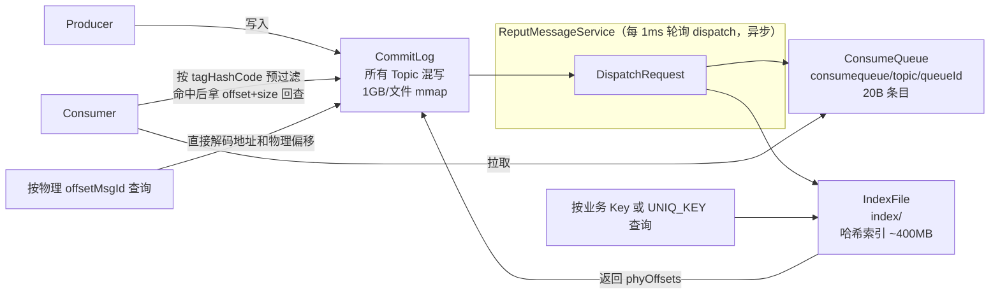
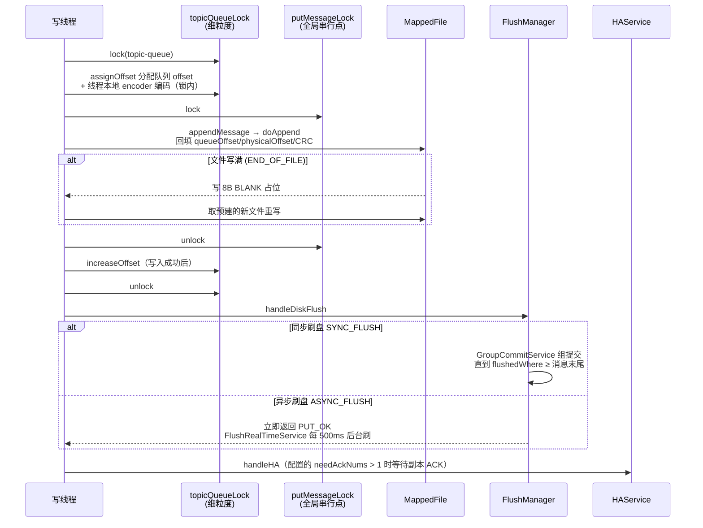
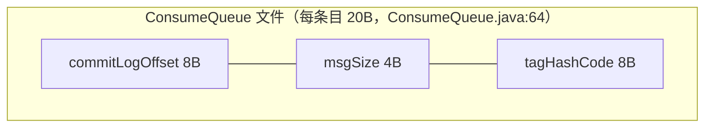
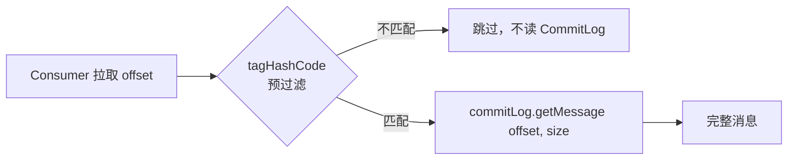
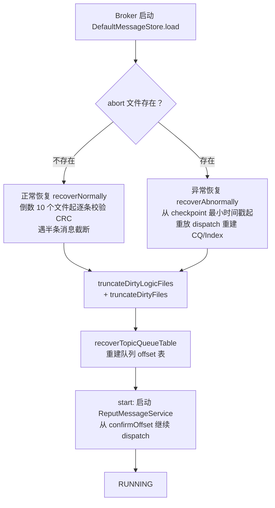

# RocketMQ 存储模型源码导读（含 Mermaid 图）

> 本文基于仓库 `learning` 分支（RocketMQ 5.5.x）源码逐文件阅读整理，所有结论均附源码文件与行号引用，可与 [rocketmq_storage_model.md](rocketmq_storage_model.md)（概念全景版）对照阅读。

## 一、总体架构：一个日志 + 两级派生索引

RocketMQ 的存储核心思想是：**所有消息不分 Topic 混写进一个全局顺序日志 CommitLog，再由后台线程异步分发（dispatch）出 ConsumeQueue（队列视图）和 IndexFile（哈希索引）两个"派生视图"**。写入快（纯顺序写 mmap 文件），消费和查询靠索引回查。

关键点：**ConsumeQueue 和 IndexFile 都只是 CommitLog 的派生视图**，宕机后可重放 dispatch 重建。

这一点与 Kafka（每个分区一个独立日志）有本质区别：RocketMQ 用"写放大换顺序写"，换来极少的文件句柄和完全顺序的磁盘写入；代价是消费时多一次 CommitLog 随机读（靠 page cache 缓解）。

## 二、磁盘目录结构

路径规则集中在 `StorePathConfigHelper.java`（`store/src/main/java/org/apache/rocketmq/store/config/StorePathConfigHelper.java:23-64`），默认根目录 `~/store`：

| 路径 | 内容 |
|---|---|
| `commitlog/` | 消息本体，默认 1GB/文件 |
| `consumequeue/{topic}/{queueId}/` | 队列索引，默认约 5.7MB/文件 |
| `index/` | 哈希索引文件（约 400MB/文件） |
| `checkpoint` | 刷盘位点文件（6 个 long） |
| `abort` | 哨兵文件：启动时创建、正常关闭时删除，用于判断上次是否宕机 |
| `config/` | topics.json、consumerOffset.json 等元数据 |
| `transaction/`、`timerwheel/` | 事务消息与定时消息的存储 |

CommitLog 和文件型 ConsumeQueue 主要由 `MappedFileQueue` 管理——内部是
`CopyOnWriteArrayList<MappedFile>` 和刷盘水位；IndexFile 则由 `IndexService` 维护自己的
IndexFile 列表，RocksDB/Tiered 存储也有独立实现。文件名通常是该文件的全局起始偏移量，
因此 CommitLog 的“全局 offset -> 文件”可以通过 `findMappedFileByOffset` 定位，但不能把
所有存储文件都归结为同一套 MappedFileQueue。

## 三、CommitLog：消息本体

### 3.1 文件组织

- 单文件默认 1GB：`MessageStoreConfig.java:52`（`mappedFileSizeCommitLog = 1024 * 1024 * 1024`）。
- 文件名即起始物理偏移（`UtilAll.offset2FileName()`，`common/src/main/java/org/apache/rocketmq/common/UtilAll.java:107-113`），如 `00000000001073741824`；加载时 `Long.parseLong(fileName)` 得到 `fileFromOffset`（`DefaultMappedFile.java:203`）。
- 写满时若剩余空间不够放一条消息（含最小空隙 `END_FILE_MIN_BLANK_LENGTH = 4+4`，`CommitLog.java:1894`），写 8 字节 `{TOTALSIZE=maxBlank, MAGICCODE=BLANK_MAGIC_CODE(-875286124)}` 占位（`CommitLog.java:2021-2035`）再滚动新文件。正常消息的 MAGICCODE 是 `-626843481`（`CommitLog.java:79`）。
- 新文件通常由 `AllocateMappedFileService` 异步创建；只有开启 `warmMapedFileEnable=true`
  且未使用 `writeWithoutMmap` 时才会逐页预热（`warmMappedFile()`）。创建请求仍可能等待
  后台服务或超时，不能保证写路径永远不发生阻塞。

### 3.2 单条消息字节布局

编码在 `MessageExtEncoder.java:175-280`，长度计算在 `calMsgLength()`（60-83 行）。字段顺序（大端序）：

```mermaid
flowchart LR
    subgraph msg["一条消息（MessageExtEncoder.java:175 编码，大端序）"]
        direction LR
        A["TOTALSIZE 4B"] --- B["MAGICCODE 4B"] --- C["BODYCRC 4B"] --- D["QUEUEID 4B"] --- E["FLAG 4B"]
        E --- F["QUEUEOFFSET 8B<br/>编码前由 assignOffset 设置"] --- G["PHYSICALOFFSET 8B<br/>写入时回填"] --- H["SYSFLAG 4B"]
        H --- I["BORNTIMESTAMP 8B"] --- J["BORNHOST 8/20B"] --- K["STORETIMESTAMP 8B"] --- L["STOREHOST 8/20B"]
        L --- M["RECONSUMETIMES 4B"] --- N["PREPARED_TX_OFFSET 8B"]
        N --- O["BODY 4B+len"] --- P2["TOPIC 1/2B+len"] --- Q2["PROPERTIES 2B+len"]
    end
```

补充说明：

- PHYSICALOFFSET 编码时先置 0（`MessageExtEncoder.java:234`，注释 "need update later"），真正写入时在全局锁内由 `doAppend` 回填（`CommitLog.java:2037` 起）；QUEUEOFFSET 编码时写入的已经是 `assignOffset` 分配好的真实队列偏移（`MessageExtEncoder.java:232`）。
- 开启 `enabledAppendPropCRC` 时 properties 尾部预留 `CRC32_RESERVED_LEN` 字节（`CommitLog.java:86`），由 `doAppend` 在锁内计算整条消息的 CRC32 写入（`CommitLog.java:2053-2061`）。
- 批量消息由 `encode(MessageExtBatch, ...)`（`MessageExtEncoder.java:282-383`）编码为多条完整布局消息的连续字节流，`doAppend` 批量版本（`CommitLog.java:2083-2178`）逐条回填。
- CommitLog 生成的物理 `offsetMsgId` 是 `storeHost:port + physicalOffset`（`CommitLog.java:1990-1998`），
  可以直接定位 CommitLog。Producer `SendResult.msgId` 通常是客户端生成的 `UNIQ_KEY`；按它或
  按业务 Key 查询时仍要经过 IndexFile，不能把两种 ID 都画成直接物理定位。
- 读取端对称解析见 `CommitLog.checkMessageAndReturnSize()`（`CommitLog.java:451-670`）。

### 3.3 写入链路

要点（入口 `CommitLog.asyncPutMessage()`，`CommitLog.java:969-1140`）：

1. 设置 `storeTimestamp`、计算 `bodyCRC`；根据 topic 长度自动选 V1/V2 消息版本、判断 IPv6 设置 sysFlag（986-1001 行）。
2. HA 前置检查：Controller 模式 / Slave Acting Master 下校验 inSyncReplicas 是否足够（1017-1036 行）。
3. `topicQueueLock`（细粒度锁，`CommitLog.java:1038`）**持锁期间**执行 `assignOffset` 分配逻辑队列偏移（1047 行），随后在同一把锁内用 `putMessageThreadLocal` 线程本地 encoder 编码（1050 行，避免编码争锁），`finally` 中才 `topicQueueLock.unlock`（1122 行）。
4. `putMessageLock`（1057 行）全局写锁内 append——锁实现三选一（`CommitLog.java:142-145`）：`AdaptiveBackOffSpinLockImpl` / `PutMessageReentrantLock`（默认，`MessageStoreConfig.java:167`）/ `PutMessageSpinLock`。**这是全局写入串行点，也是单 Broker 吞吐的上限所在**。
5. 锁内 `mappedFile.appendMessage(...)`（1079 行）→ `appendMessagesInner()`（`DefaultMappedFile.java:351-420`）取 `writeBuffer != null ? writeBuffer : mappedByteBuffer` 的 slice，position=wrotePosition，调 `DefaultAppendMessageCallback.doAppend()` 回填后 `byteBuffer.put(preEncodeBuffer)`，用 `WROTE_POSITION_UPDATER.addAndGet(...)` 原子累加 `wrotePosition`（`DefaultMappedFile.java:416`）。
6. `END_OF_FILE` 时写 BLANK、`getLastMappedFile(0)` 建新文件重写（1084-1101 行）；成功后 `increaseOffset`（1117 行）。
7. 解锁后进入 `handleDiskFlushAndHA()`（实现在 1330-1349 行，调用点 1139 行）：`handleDiskFlush` 与 `handleHA` 两个 future `thenCombine`。

### 3.4 刷盘：四种组合

刷盘统一抽象为接口 `FlushManager`（`FlushManager.java:23-36`），默认实现 `CommitLog.DefaultFlushManager`（`CommitLog.java:2182-2297`）：

| 组合 | 实现 | 行为 |
|---|---|---|
| 同步刷盘 | `GroupCommitService`（`CommitLog.java:1675-1781`） | 读写双链表 swap 组提交，每 10ms 批量 flush；写线程等 `flushedWhere >= 消息末尾` 才返回（`syncFlushTimeout` 默认 5s，`MessageStoreConfig.java:249`） |
| 异步刷盘（默认） | `FlushRealTimeService`（`CommitLog.java:1548-1632`） | 每 500ms（`flushIntervalCommitLog`）刷一次，攒满 4 页（`flushCommitLogLeastPages`）才刷，超过 10s（`flushCommitLogThoroughInterval`）强制全刷 |
| 异步刷盘 + transientStorePool | `CommitRealTimeService`（`CommitLog.java:1493-1546`） | 先把堆外 writeBuffer commit 到 FileChannel（每 200ms），再唤醒 flush |
| 同步复制 | `handleHA`（`CommitLog.java:1355-1370`） | `SYNC_MASTER` 且配置的 `needAckNums > 1` 时等足够副本的 ACK；默认值 1 会直接成功 |

底层 flush：`MappedFileQueue.flush()`（658-673 行）→ `DefaultMappedFile.flush()`（526-559 行）→ `mappedByteBuffer.force()` 或 `fileChannel.force(false)`。

### 3.5 transientStorePool

`TransientStorePool.java:31-93`：一组**被 mlock 锁定在物理内存中的堆外 DirectByteBuffer 池**（默认池大小 5，`MessageStoreConfig.java:267`；每个 buffer 大小 = mappedFileSize）。

- 开启后每个新建的 MappedFile 从池里 `borrowBuffer()` 作为 `writeBuffer`（`DefaultMappedFile.java:193-195`），**消息先写入这块锁定内存而非 mmap 的 page cache**，之后由 `CommitRealTimeService` 定期 `commit()`（`commit0()`，589-605 行）通过 `fileChannel.write()` 搬到 FileChannel，再由 flush 落盘；文件写满且全部 commit 后 `returnBuffer()` 归还池（580-584 行）。
- 目的：**写路径与读路径分离**——写入绕过 mmap 区域，避免写造成的 page cache 抖动影响读（消费者拉取命中 page cache），同时锁定内存保证写延迟稳定。代价是多了"堆外 buffer → FileChannel"一次拷贝。
- 派发/读不能超过已提交位置：real commit 模式下 `getReadPosition()`（`DefaultMappedFile.java:788`）取 `committedPosition`。

## 四、ConsumeQueue：队列视图

### 4.1 物理组织与 20 字节条目

在用的是 store 根目录下的 `ConsumeQueue.java`（`CQType.SimpleCQ`，1108-1110 行）；实例化入口 `queue/ConsumeQueueStore.java:244-252`，按 `CQType` 分为 `SimpleCQ` / `BatchCQ` / `RocksDBCQ` 三种（`CQType` 枚举在 `common/.../attribute/CQType.java:21-23`）。

条目格式（`ConsumeQueue.java:52-64` 注释）：

- 每文件默认 `300000 × 20 = 6000000 字节`（约 5.7MB），即 30 万条（`MessageStoreConfig.java:138`）。
- 目录：`{storePathRootDir}/consumequeue/{topic}/{queueId}/{起始offset数字}`；一个 topic/queueId 对应一个 `ConsumeQueue` 对象，内部是一个 `MappedFileQueue`。
- 写入条目：`putMessagePositionInfo()`（`ConsumeQueue.java:836-899`）依次 putLong(offset)/putInt(size)/putLong(tagsCode)；`expectLogicOffset = cqOffset × 20`（855 行）保证队列 offset 与物理位置一一对应，新队列文件起始位置非零会 `fillPreBlank` 填充空白（901-916 行）。
- 关键游标：`maxPhysicOffset`（78 行）、`minLogicOffset`（CommitLog 删除后由 `correctMinOffset()` 二分修正，554-717 行）。
- 队列 offset 换算：`getMinOffsetInQueue() = minLogicOffset / 20`（720-722 行），`getMaxOffsetInQueue() = mappedFileQueue.getMaxOffset() / 20`（1136-1139 行）。

### 4.2 消费定位流程

入口 `DefaultMessageStore.getMessage()`（`DefaultMessageStore.java:865-1012`）：

1. `findConsumeQueue(topic, queueId)`（896 行）取 min/max offset 做边界校验（898-912 行）。
2. `consumeQueue.iterateFrom(nextBeginOffset, maxMsgNums)`（932 行）→ `getIndexBuffer()`（918-928 行）：`offset = startIndex × 20` 定位 mmap 文件；迭代器每 20 字节解出一个 `CqUnit(queueOffset, pos, size, tagsCode)`（1019-1042 行）。
3. **tag 预过滤**（974-975 行）：`cqUnit.getValidTagsCodeAsLong()` + `cqExtUnit` 做 tag/bit map 预过滤，不匹配不读 CommitLog——**这是 ConsumeQueue 的核心价值**。
4. `commitLog.getMessage(offsetPy, sizePy)`（983 行）从 CommitLog 读出完整消息。
- 按时间查 offset：`getOffsetInQueueByTime()`（`ConsumeQueue.java:228-232`）在队列条目上二分。
- 队列 offset 管理：`QueueOffsetOperator`（`queue/QueueOffsetOperator.java:38-44`）维护 `topic-queueId -> next offset` 内存表。

### 4.3 Dispatch 流程（CommitLog → ConsumeQueue/Index）

- **注册分发器**：`DefaultMessageStore` 构造函数 248-249 行注册 `CommitLogDispatcherBuildConsumeQueue` 和 `CommitLogDispatcherBuildIndex`（另有 `CommitLogDispatcherBuildTransIndex`，2270 行，RocksDB 事务索引）。
- **ReputMessageService**（`DefaultMessageStore.java:2655-2843`）：`run()` 循环每 1ms 调一次 `doReput()`（2823-2829 行）；`isCommitLogAvailable()`（2703-2705 行）= `reputFromOffset < getReputEndOffset()`（默认为 `commitLog.getConfirmOffset()`）。
- **doReput**（2711-2789 行）：`commitLog.getData(reputFromOffset)`（2723 行）→ `checkMessageAndReturnSize()` 解出 `DispatchRequest`（2733-2734 行）→ `doDispatch`（2745 行）→ `reputFromOffset += size`；`size == 0` 时 `rollNextFile` 跳到下一个 CommitLog 文件（2762 行）。
- **启动时机**：`start()`（442 行）统一把 `reputFromOffset` 初始化为 `confirmOffset` 再启动（`DefaultMessageStore.java:442-443`），正常启动与崩溃恢复启动行为一致。之后会调用 `doRecheckReputOffsetFromCq()`（502/513 行所在的"按 CQ 已 dispatch 位点校验 reput 起点"逻辑），但该方法开头就检查 `recheckReputOffsetFromCq`（默认 false，`MessageStoreConfig.java:305`），**默认配置下不会执行**，主要用于 DLedger/自动主从切换场景校验 dispatch 一致性。
- **长轮询唤醒**：dispatch 后若开启 long polling，2644-2652 行 `notifyMessageArriveIfNecessary()` 通知挂起的拉取请求。
- **DispatchRequest 字段**（`DispatchRequest.java:24-49`）：`topic, queueId, commitLogOffset, msgSize, tagsCode, storeTimestamp, consumeQueueOffset, keys, success, uniqKey, sysFlag, preparedTransactionOffset, propertiesMap, bitMap` 及 batch 用的 `msgBaseOffset/batchSize`。

所以**写入 CommitLog 和构建索引是解耦的**，Broker 宕机恢复时靠重放 dispatch 补齐。

### 4.4 变体

- **ConsumeQueueExt**（`ConsumeQueueExt.java`）：存"不重要的"附加信息（消息存储时间、filter bit map），弱可靠。存储单元 `CqExtUnit`（451-484 行）：`size(2B) + tagsCode(8B) + msgStoreTime(8B) + bitMapSize(2B) + filterBitMap(变长)`。**关键设计：ext 地址是负数**——`decorate()/unDecorate()` 用 `Long.MIN_VALUE` 做偏移（150-171 行），ConsumeQueue 条目的 tagsCode 字段被"复用"：负值表示是 ext 文件地址，非负才是真正的 tag hashcode（`CqUnit.java:30-34` 注释）。主要用于 SQL92/类过滤。
- **BatchConsumeQueue**（`queue/BatchConsumeQueue.java:53-63`）：条目 46 字节 = `commitLogOffset(8) + size(4) + tagHashCode(8) + storeTime(8) + msgBaseOffset(8) + batchSize(2) + compactedOffset(4) + reserved(4)`，一条条目代表一批消息。

## 五、IndexFile：哈希索引

详细分析另见 [rocketmq_indexfile.md](rocketmq_indexfile.md)，此处摘要：

- **布局**：`40B IndexHeader + 500万槽 × 4B + 2000万条目 × 20B ≈ 400MB`（`IndexFile.java:54-58`；`maxHashSlotNum = 5000000`、`maxIndexNum = 5000000 * 4`，`MessageStoreConfig.java:228-229`）。
- **IndexHeader 40B**（`IndexHeader.java:24-43`）：beginTimestamp/endTimestamp/beginPhyOffset/endPhyOffset/hashSlotCount/indexCount；indexCount 初始值为 1（0 保留为"无效索引"标记，`IndexFile.java:46`）。
- **条目 20B**：`keyHash(4B) + phyOffset(8B) + timeDiff(4B，相对 beginTimestamp 的秒差) + nextIndexPos(4B)`，`nextIndexPos` 保存同槽中上一条（更旧）记录的下标，查询时沿它从新到旧遍历。
- **冲突解决**：头插法单向链表——槽存最新条目序号，新条目的 prevIndex 指向旧条目；查询沿链回溯（`selectPhyOffset`，`IndexFile.java:216-251`），靠 `keyHashRead == keyHash` 过滤假冲突，靠 `timeRead < begin` 提前剪枝。
- **key 构造**（`IndexService.buildKey()`，217-222 行）：uniqKey 与业务 keys 为 `topic#key`，tag 索引为三段式 `topic#T#tag`（`INDEX_TAG_TYPE = "T"`）；每条消息最多建 3 类索引——uniqKey、业务 keys、tag（`buildIndex`，224-282 行）。
- **查询**（`IndexService.queryOffset()`，169-215 行）：从最新文件向最旧遍历，文件级时间区间粗过滤 + 条目级时间细过滤，返回 CommitLog 物理偏移列表。
- **创建/删除**：最后一个文件写满才创建新文件，文件名是时间戳人类可读格式（`IndexService.java:353-355`）；删除跟着 CommitLog 走——`endPhyOffset < commitLog.minOffset` 的文件连带删除，但永远保留最新一个（`IndexService.java:110-131`）。

## 六、过期删除与恢复

### 6.1 过期删除

- **CleanCommitLogService**（`DefaultMessageStore.java:2301-2573`）：每 10s（`cleanResourceInterval`）检查。触发条件包括到达 `deleteWhen`（默认凌晨 4 点）、磁盘使用率达到清理判断阈值或手动删除。`diskSpaceWarningLevelRatio` 默认 90%，超过会标记磁盘满并进入立即清理；`diskSpaceCleanForciblyRatio` 默认 85% 会触发更激进的清理；`diskMaxUsedSpaceRatio = 75%` 在普通单路径以及多路径逻辑容量判断中也会参与清理触发。删除依据是**文件最大时间戳超过 `fileReservedTime`（默认 72 小时，`MessageStoreConfig.java:188`）**。
- **CleanConsumeQueueService**（`queue/ConsumeQueueStore.java:867-907`）：CQ 不按时间删除，而是**跟着 CommitLog 走**——`commitLog.getMinOffset()` 前进后，删除各 CQ 中 maxPhysicOffset 落后的文件，并同步删除过期 index 文件（897-900 行）。这是"CQ 只是视图"的直接体现。

### 6.2 启动恢复流程

入口 `DefaultMessageStore.load()`（`DefaultMessageStore.java:325-379`），全程由 `MessageStoreStateMachine` 记录状态迁移：

1. `lastExitOK = !isTempFileExist()`（329 行），即 abort 文件存在 = 异常退出。
2. load CommitLog（334 行）→ load ConsumeQueue（337 行）→ 可选加载 compaction/checkpoint/index。
3. **正常恢复** `commitLog.recoverNormally(dispatchFromPhyOffset)`（407 行，实现 `CommitLog.java:340-433`）：从倒数第 10 个文件（`commitLogRecoverMaxNum=10`）内找第一个匹配的文件，逐条 `checkMessageAndReturnSize()` 校验（`checkCRCOnRecover` 默认 true），遇半条消息即截断，随后 `truncateDirtyLogicFiles` + `truncateDirtyFiles`（421-425 行）。
4. **异常恢复** `commitLog.recoverAbnormal()`（409 行，实现 `CommitLog.java:738-844`）：从后往前找 `storeTimestamp >= checkpoint 最小时间戳` 的文件作为起点，重放 dispatch 重建 CQ/index；支持 `enableAcceleratedRecovery` 从 `dispatchFromPhyOffset` 起跳（773-785 行）。
5. `recoverTopicQueueTable()`（414 行）重建 TopicQueue offset 表。
6. `start()`（422-463 行）：HA 初始化、启动 `allocateMappedFileService`、加 lock 文件锁、启动 `reputMessageService`（从 confirmOffset 开始）、checkpoint 每秒定时 flush。

**StoreCheckpoint**（`StoreCheckpoint.java`）：一个 mmap 的 `checkpoint` 文件，记录 6 个 long：`physicMsgTimestamp`（offset 0）、`logicsMsgTimestamp`（8）、`indexMsgTimestamp`（16）、`masterFlushedOffset`（24）、`confirmPhyOffset`（32）、`logicsPhysicalOffset`（40）。`getMinTimestamp()`（157-166 行）取物理/逻辑最小值减 3 秒，正是异常恢复时"从哪个时间点开始恢复"的依据。

## 七、5.x 的演进

- `StoreType`（`StoreType.java:25-27`）支持 `default` 与 `defaultRocksDB`：后者（`RocksDBMessageStore` 继承 `DefaultMessageStore`，覆写 `createConsumeQueueStore()` 和 `isNotifyMessageArriveWhenReput()`——后者返回 false，因为 RocksDB CQ 由 `RocksGroupCommitService` 异步提交，reput 时不再立即通知消费者）把 ConsumeQueue 换成 RocksDB KV 实现，解决海量队列场景下 CQ 文件数过多的问题；**CommitLog 本身仍是 mmap 文件**。
- `tieredstore` 模块以插件形式（`TieredMessageStore`）把本地盘冷数据卸载到对象存储等廉价介质，以低成本延长消息保留时间。

## 八、总结

RocketMQ 存储模型可以概括为：**以单个全局 CommitLog 顺序日志为唯一事实源（Source of Truth），ConsumeQueue 和 IndexFile 都是从它派生、可随时重建的索引视图；写入靠 mmap + 组提交刷盘保证顺序写吞吐，读取靠 page cache + tag 预过滤弥补随机读代价；可靠性靠 checkpoint + 重放 dispatch 恢复，靠 abort 文件区分正常/异常退出**。

这个"日志 + 派生视图"的结构，是把 Kafka 的分区日志模型改造成"全局单日志"后的产物。理解了这一点，store 模块里所有组件（MappedFileQueue、ReputMessageService、CleanCommitLogService、StoreCheckpoint）的职责就都顺理成章了。
